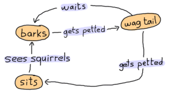
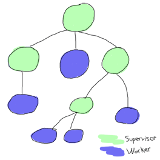
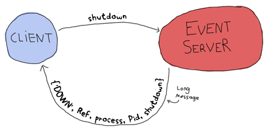
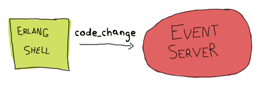

# Hello Erlang!
These are notes and mostly quotes i take about Erlang in my learning process.<br>
Check [resources](#resources) section to see where I take quotes from.<br>
Note that this repo is always a *work in progress*.
(I couldn't find the time to complete the book yet.)


***

# Topics
<details><summary><strong>gotchas</strong></summary><br>

- erlang has no such thing as a `null` value
- every function needs to return something
- erlang doesn't allow default arguments in functions
- erlang is built on the notion that a failure in one of the components should not affect the whole system
- every erlang term can be compared to any other
- erlang is a functional but not a pure functional language, there are side effects, like registering process names.

</details>
<details><summary><strong>sayings</strong></summary><br>

- Walking on water and developing software from a specification are easy if both are frozen. - *Edward V. Berard*
- Some people, when confronted with a problem, think “I know, I’ll use regular expressions." Now they have two problems. - *Jamie Zawinski*

</details>

## basic data types
<details><summary><strong>numbers</strong></summary><br>

both floating point numbers or integers are supported when dealing with arithmetic. Integers and floating values are pretty much the only types of data Erlang's mathematical operators will handle transparently for you. to have the integer-to-integer division, use `div`, and to have the modulo operator, use `rem`.

    5 / 2.
    -> 2.5

    5 div 2
    -> 2

to express integers in other bases than base 10, just enter the number as `Base#Value` (given `Base` is in the range `2..36`):

    2#101010.
    -> 42

    8#0677.
    -> 447

    16#AE.
    -> 174

</details>
<details><summary><strong>invariable variables</strong></summary><br>

variable names must begin with a capital letter. you can assign a value to a variable exactly once. you can `pretend` to assign a value to a variable if it's the same value it already has.

    One = 1.
    Two = One + One.
    Two = 2.
    Two = 3.
    -> ** exception error: no match of right hand side value 3

the `=` operator has the role of comparing values and complaining if they're different. If they're the same, it returns the value.

    47 = 45 + 3.
    -> ** exception error: no match of right hand side value 48

if the left-hand side term is a variable and it is `unbound` (has no value associated to it), Erlang will automatically bind the right-hand side value to the variable on the left-hand side. The comparison will consequently succeed and the variable will keep the value in memory.

the `=` operator is the basis of the `pattern matching`

technically, variables can start with an underscore too, but by convention their use is restricted to values you do not care about, yet you felt it was necessary to document what it contains.

</details>
<details><summary><strong>atoms</strong></summary><br>

atoms are literals, constants with their own name for value. an atom should be enclosed in single quotes (') if it does not begin with a lower-case letter or if it contains other characters than alphanumeric characters, underscore or @.

    atom.
    atoms_rule@erlang.
    'Atoms can be cheated!'.

an atom with single quotes is exactly the same as a similar atom without them

    atom = 'atom'.
    -> atom

an atom is referred to in an `atom table` which consumes memory. atom table is not garbage collected, and so atoms will accumulate until the system tips over, either from **memory usage** or because **1048577** atoms were declared. this means atoms should not be generated dynamically for whatever reason.

some atoms are reserved words: `after`, `and`, `andalso`, `band`, `begin`, `bnot`, `bor`, `bsl`, `bsr`, `bxor`, `case`, `catch`, `cond`, `div`, `end`, `fun`, `if`, `let`, `not`, `of`, `or`, `orelse`, `query`, `receive`, `rem`, `try`, `when`, `xor`

atoms can only be compared and nothing else

</details>
<details><summary><strong>boolean algebra</strong></summary><br>

there is not much to say

    true and false.
    -> false

    false or true.
    -> true

    true xor false.
    -> true

    not false.
    -> true

    not (true and true).
    -> false

the boolean operators `and` and `or` will always evaluate arguments on both sides of the operator. If you want to have the short-circuit operators (which will only evaluate the right-side argument if it needs to), use `andalso` and `orelse`.

erlang has no such things as boolean `true` and `false`. **the terms true and false are atoms**, *but they are integrated well enough into the language you shouldn't have a problem with that as long as you don't expect false and true to mean anything but false and true.*

</details>
<details><summary><strong>comparison operators</strong></summary><br>

- `=:=` exactly equal
- `=/=` exactly not equal
- `==` equal
- `/=` not equal
- `<` less than
- `>` greather than
- `>=` greater than or equal to
- `=<` less than or equal to

```
5 =:= 5.
-> true

1 =:= 0.
-> false

1 =/= 0.
-> true

5 =:= 5.0.
-> false

5 =:= true.
-> false

5 == 5.0.
-> true

5 /= 5.0.
-> false

1 < 2.
-> true

1 < 1.
-> false

1 >= 1.
-> true

1 =< 1.
-> true

5 + llama.
-> ** exception error: bad argument in an arithmetic expression
```

the correct ordering of each element in a comparison is the following: <br>
`number` **<** `atom` **<** `reference` **<** `fun` **<** `port` **<** `pid` **<** `tuple` **<** `map` **<** `list` **<** `bit string`

this is why you can compare anything with anything.
```
0 == false.
-> false

1 < false.
-> true
```

</details>
<details><summary><strong>tuples</strong></summary><br>

A tuple is a way to organize data.

    Point = {3,5}.

    {X,Y} = Point.
    X.
    -> 3
    Y.
    -> 5

    {_,Y2} = Point.
    Y2.
    -> 5

`_` is the anonymous variable. this is exactly how it's meant to be used: to drop the value that would usually be placed there since we won't use it. The `_` variable is always seen as unbound and acts as a wildcard for pattern matching.

pattern matching to unpack tuples will only work if the number of elements (the tuple's length) is the same.

    {_,_} = {4,5,6}.
    -> ** exception error: no match of right hand side value {4,5,6}

tuples can also be useful when working with single values.

    PreciseTemperature = {celsius, 23.213}.
    {kelvin, T} = PreciseTemperature.
    -> ** exception error: no match of right hand side value {celsius,23.213}

a tuple which contains an atom with one element following it is called a `tagged tuple`.

    {point, {X,Y}}.

get `nth` element of a tuple

    element(2,{a,b,c}).
    -> b

you can do some arithmetic classifying operations on tuples such as sort, min, max, etc.

    lists:sort([{2, b}, {4, d}, {1, a}, {3, c}]).
    -> [{1,a},{2,b},{3,c},{4,d}]

    erlang:min({3, x}, {1, y}).
    -> {1, y}

    erlang:max({3, x}, {7, y}).
    -> {7, y}

</details>
<details><summary><strong>lists</strong></summary><br>

lists can contain anything and you can mix more than one type of data in it.

    [1, 2, 3, {numbers,[4,5,6]}, 5.34, atom].

strings are lists and the notation is absolutely the exact same

    [97, 98, 99].
    -> "abc"

erlang will print lists of numbers as numbers only when at least one of them could not also represent a letter

    [97,98,99,4,5,6].
    -> [97,98,99,4,5,6]

    [233].
    -> "é"

there is no such thing as a real string in erlang

glue lists together

    [1,2,3] ++ [4,5].
    -> [1,2,3,4,5]

remove elements from a list

    [1,2,3,4,5] -- [1,2,3].
    -> [4,5]

    [2,4,2] -- [2,4].
    -> [2]

    [2,4,2] -- [2,4,2].
    -> []

    [2,3,4,5] -- [3,4].
    -> [2,5]

    [2,3,4,5] -- [3,5].
    -> [2,4]

both `++` and `--` are right-associative

    [1,2,3] -- [1,2] -- [3].
    -> [3]

    [1,2,3] -- [1,2] -- [2].
    -> [2,3]

get length

    length([1,2,3,4]).
    -> 4

get head

    hd([1,2,3,4]).
    -> 1

get tail

    tl([1,2,3,4]).
    -> [2,3,4]

or use pattern matching

    [Head|Tail] = [1,2,3,4].

    Head.
    -> 1

    Tail.
    -> [2,3,4]

    [First, Second | Rest] = [1,2,3,4,5].
    -> [1,2,3,4,5]
    First.
    -> 1
    Second.
    -> 2
    Rest.
    -> [3,4,5]

add head

    List = [2,3,4].
    NewList = [1|List].
    -> [1,2,3,4]

`|` is named the `cons operator` (constructor),  any list can be built with only cons and values

    [3 | [2 | [1 | []] ] ].
    -> [3,2,1]

note: using the form `[1 | 2]` gives what we call an `improper list`. improper lists will work when you pattern match in the `[Head|Tail]` manner, but will fail to be used with standard functions of erlang (even `length()`). this is because erlang expects `proper lists`. proper lists **end with an empty list** as their last cell. when declaring an item like `[2]`, the list is automatically formed in a proper manner. as such, `[1|[2]]` would work! improper lists, although syntactically valid, are of very limited use outside of user-defined data structures.

</details>
<details><summary><strong>strings</strong></summary><br>

we know that strings are actually lists and there is no such thing as a real string in erlang. but we can create strings (lists) easily with double quote `"`. remember single quotes `'` are for atoms.

    String = "my string".

    is_list(String).
    -> true

but even there is no real strings, there are string operations on erlang;

    string:uppercase("hello").
    -> "HELLO"

    string:tokens("10 4 3 + 2 * -", " ").
    -> ["10","4","3","+","2","*","-"]

    string:to_float("1.3").
    -> {1.3,[]}

    list_to_integer("23").
    -> 23

    string:to_integer("23").
    -> {23,[]}

> **see [road.erl](./code/examples/road.erl) as example of string operations**

</details>
<details><summary><strong>list comprehensions</strong></summary><br>

list comprehensions are ways to build or modify lists. it's based off the idea of set notation.

    [2*N || N <- [1,2,3,4]].
    -> [2,4,6,8]

    [X || X <- [1,2,3,4,5,6,7,8,9,10], X rem 2 =:= 0].
    -> [2,4,6,8,10]

the `arrow` acts exactly like the `=` operator, with the exception that **it doesn't throw exceptions**.

    RestaurantMenu = [{steak, 5.99}, {beer, 3.99}, {poutine, 3.50}, {kitten, 20.99}, {water, 0.00}].

    %prices of all the items costing between $3 and $10 with taxes 7%
    [{Item, Price*1.07} || {Item, Price} <- RestaurantMenu, Price >= 3, Price =< 10].

    -> [{steak,6.4}, {beer,4.3}, {poutine,3.7}]

recipe for list comprehensions in erlang is therefore; `NewList = [Expression || Pattern <- List, Condition1, Condition2, ... ConditionN]`. the part `Pattern <- List` is named a `generator expression`. you can have more than one.

    [X+Y || X <- [1,2], Y <- [2,3]].
    -> [3,4,4,5]

permutation example

    [{X,Y,Z} || X <- [1,2,3], Y <- [1,2,3], Z <- [1,2,3], X =/= Y, Y =/= Z, X =/= Z].
    -> [{1,2,3}, {1,3,2}, {2,1,3}, {2,3,1}, {3,1,2}, {3,2,1}]

more generic recipe would be; `NewList = [Expression || GeneratorExp1, GeneratorExp2, ..., GeneratorExpN, Condition1, Condition2, ... ConditionM]`

expressions coupled with pattern matching also act as a filter:

    Weather = [{toronto, rain}, {montreal, storms}, {london, fog},{paris, sun}, {boston, fog}, {vancouver, snow}].

    FoggyPlaces = [X || {X, fog} <- Weather].

    -> [london,boston]

</details>
<details><summary><strong>bit syntax</strong></summary><br>

bit syntax encloses binary data between `<<` and `>>`, splits it in readable segments, and each segment is separated by a comma. a segment is a sequence of bits of a binary (not necessarily on a byte boundary, although this is the default behaviour)

    Color = 16#F09A29.
    -> 15768105

    Pixel = <<Color:24>>.
    -> <<240,154,41>>

this basically says **put the binary values of `#F09A29` on `24 bits` of space (red on 8 bits, green on 8 bits and blue also on 8 bits) in the variable Pixel.**

    Pixels = <<213,45,132,64,76,32,76,0,0,234,32,15>>.

    % tell erlang that each variable on the left side will hold 24 bits of data
    <<Pix1:24, Pix2:24, Pix3:24, Pix4:24>> = Pixels.

    % then take the first pixel and unpack it further into single color values
    <<R:8, G:8, B:8>> = <<Pix1:24>>.
    -> <<213,45,132>>

    % take only the first color from the start
    <<R:8, Rest/binary>> = Pixels.
    R.
    -> 213

more than one way to describe a binary segment is accepted. those are all valid:

- `Value`
- `Value:Size`
- `Value/TypeSpecifierList`
- `Value:Size/TypeSpecifierList`

`Size` is going to represent bits or bytes (depending on `Type` and `Unit` below), and `TypeSpecifierList` represents one or more of the following:

- **Type**
  - possible values: `integer` | `float` | `binary` | `bytes` | `bitstring` | `bits` | `utf8` | `utf16` | `utf32`
  - represents the kind of binary data used
  - `bytes` is shorthand for `binary` and `bits` is shorthand for `bitstring`
  - default: `integer`
- **Signedness**
  - possible values: `signed` | `unsigned`
  - default: `unsigned`
- **Endianness**
  - possible values: `big` | `little` | `native`
  - only matters when the Type is either `integer`, `utf16`, `utf32`, or `float`
  - this has to do with **how the system reads binary data**. as an example, the BMP image header format holds the size of its file as an integer stored on `4 bytes`. for a file that has a size of `72` bytes, a `little-endian` system would represent this as `<<72,0,0,0>>` and a `big-endian` one as `<<0,0,0,72>>`. one will be read as `72` while the other will be read as `1207959552`, so make sure you use the right endianness. there is also the option to use `native`, which will choose at run-time if the CPU uses little-endianness or big-endianness natively.
  - default: `big`
- **Unit**
  - written `unit:Integer`
  - the size of each segment, in bits
  - allowed range is `1..256`
  - default is 1 for `integers`, `floats` and `bitstrings` (`bits`)
  - default is 8 for `binary` (`bytes`)
  - `utf8`, `utf16` and `utf32` types require no unit to be defined
  - the multiplication of `Size` by `Unit` is equal to the number of bits the segment will take and must be evenly divisible by `8`. the unit size is usually used to ensure byte-alignment.

`TypeSpecifierList` is built by separating attributes by a `-`

    <<X1/unsigned>> = <<-44>>.
    X1.
    -> 212

    <<X2/signed>> = <<-44>>.
    X2.
    -> -44

    <<X2/integer-signed-little>> = <<-44>>.
    X2.
    -> -44

    <<N:8/unit:1>> = <<72>>.
    N.
    -> 72

    <<N/integer>> = <<72>>.
    N.
    -> 72

    <<Y:4/little-unit:8>> = <<72,0,0,0>>.
    Y.
    -> 72

binary operations:

- `bsl` bit shift left
- `bsr` bit shift right
- `band` and
- `bor` or
- `bxor` xor
- `bnot` not

operators could be used as infix operators

    2#00100 = 2#00010 bsl 1.
    2#00001 = 2#00010 bsr 1.
    2#10101 = 2#10001 bor 2#00101.

parsing TCP segments example:

    <<SourcePort:16, DestinationPort:16, AckNumber:32,
    DataOffset:4, _Reserved:4, Flags:8, WindowSize:16,
    CheckSum: 16, UrgentPointer:16, Payload/binary>> = SomeBinary.

**bit strings:** more efficient in terms of space, because normal lists are linked lists while bit strings are more like C arrays. downside of binary strings compared to lists is a loss in simplicity when it comes to pattern matching and manipulation. people tend to use binary strings when storing text that won't be manipulated too much or when space efficiency is a real issue. dont use strings instead of atoms, or atoms instead of strings. strings can be manipulated (splitting, regular expressions, etc) while atoms can only be compared and nothing else.

    Bitstring = <<"this is a bit string!">>.
    Bitstring.
    -> <<"this is a bit string!">>

</details>
<details><summary><strong>binary comprehensions</strong></summary><br>

binary comprehensions are to bit syntax what list comprehensions are to lists: a way to make code short and concise

    [X || <<X>> <= <<1,2,3,4,5>>, X rem 2 == 0].

only change in syntax from regular list comprehensions is the `<-` which became `<=` and using `binaries` `<<>>` instead of `lists` `[]`

    Pixels = <<213,45,132,64,76,32,76,0,0,234,32,15>>.
    RGB = [{R,G,B} || <<R:8,G:8,B:8>> <= Pixels].
    RGB.
    -> [{213,45,132},{64,76,32},{76,0,0},{234,32,15}]

changing `<-` to `<=` let us use a binary stream as a generator

binary comprehension syntax to change non-binary data to binary data;

    << <<R:8, G:8, B:8>> ||  {R,G,B} <- RGB >>.

it is possible to have a binary comprehension with a binary generator

    << <<(X+1)/integer>> || <<X>> <= <<3,7,5,4,7>> >>.

</details>

## modules
<details><summary><strong>modules</strong></summary><br>

- modules are a bunch of `functions` regrouped in a single file, under a single name.
- all functions in erlang must be defined in modules.
- modules need to be called in form of `Module:Function(Arguments)`
- you can declare two kinds of things in a module: `functions` and `attributes`

check [hello.erl](./code/hello.erl) for first module example

## attributes

all module attributes follow the form `-Name(Attribute).` <br>
attributes are metadata describing the module itself such as its name, the functions that should be visible to the outside world, the author of the code, and so on.

`-module(Name)` <br>
necessary for your module to be compilable: name of the current module. this is the name you'll use to call functions from other modules. `Name` is an `atom`.

`-export([Function1/Arity, Function2/Arity, ..., FunctionN/Arity]).` <br>
defines what functions of a module can be called by the outside world.

`-import(Module, [Function1/Arity, ..., FunctionN/Arity]).` <br>
erlang programmers are often discouraged from using this attribute. leaving the module name in is considered good practice.

`-vsn(VersionNumber).` <br>
unique value differentiating each version of your code. this will be generated automatically if you dont specify. see the compiling topic.

`-author("Sterling Archer").` <br>
author info

- **the arity of a function is an integer representing how many arguments can be passed to the function.**
- different functions defined within a module can share the same name if and only if they have a different arity.
- the functions `add(X,Y)` and `add(X,Y,Z)` would thus be considered different and written in the form `add/2` and `add/3` respectively.

## functions

a function follows the form `Name(Args) -> Body.`<br>
- `Name` has to be an `atom` and `Body` can be **one or more** erlang `expressions` separated by commas.
- the function is ended with a period.
- last logical expression of a function to be executed will have its value returned to the caller
- functions and expressions **must always return something**, if they wont, they will crash

## macros

a macro is defined as a module attribute of the form:`-define(MACRO, some_value).` <br>
and is used as `?MACRO` inside any function defined in the module.

a function macro example

    % define
    -define(sub(X,Y), X-Y).

    % usage
    ?sub(23,47).

`?MODULE` is a macro returning the current module's name.

## comments
comments are single-line only and begin with a `%` sign (using `%%` is purely a question of style.)

## module design
- avoid circular dependencies!
- it is usually considered a good practice to regroup functions that have similar roles close together

</details>
<details><summary><strong>compiling and using the code</strong></summary><br>

erlang code is compiled to `bytecode` in order to be used by the `virtual machine`.
- from command line: `erlc flags file.erl`
- from shell or in module `compile:file(FileName)`
- from shell `c(FileName)`
  - c("code/function_syntax/pattern").

## using without compiling the code

[`escript`](http://erlang.org/doc/man/escript.html) provides support for running short Erlang programs without having to compile them first, and an easy way to retrieve the command-line arguments.

## compiling from command line

    $ erlc code/examples/road.erl
    -> code/examples/road.erl:2: Warning: export_all flag enabled - all functions will be exported

    $ erl -noshell -run road main code/examples/road.txt
    -> [{b,10},{x,30},{a,5},{x,20},{b,2},{b,8}]

## compiling code from shell

`erl`

    cd("/path/to/where/you/saved/the-module/").
    -> ok

    c(hello).
    -> {ok,hello}

    % or

    compile:file(hello).
    -> {ok,hello}

    % compiling with some flags, see below for flags

    c(hello, [debug_info, export_all]).
    -> {ok,hello}

    % or

    compile:file(hello, [debug_info, export_all]).
    -> {ok,hello}

### usage in shell after compiling from shell

after code is compiled, a `hello.beam` file will be added next to `hello.erl` in your directory. this is the compiled module.
`.beam` stands for `Bogdan/Björn's Erlang Abstract Machine`, which is the VM itself.

let's try our module:

    hello:add(7,2).
    -> 9

    hello:hello().
    -> Hello, world!
    -> ok % io:format/1 returns 'ok' to denote a normal condition, the absence of errors.

    hello:greet_and_add_two(7).
    -> Hello, world!
    -> 9

    hello:print_macroex().
    -> 7

## compilation flags
the most common flags are:

`-debug_info`<br>
erlang tools such as debuggers, code coverage and static analysis tools will use the debug information of a module in order to do their work.

`-{outdir,Dir}`<br>
by default, the erlang compiler will create the `beam` files in the current directory. this will let you choose where to put the compiled file.

`-export_all`<br>
will ignore the `-export` module attribute and will instead export all functions defined. useful for testing.

`-{d,Macro}` or `{d,Macro,Value}`
defines a macro to be used in the module, where `Macro` is an atom. more frequently used when dealing with `unit-testing`, ensuring that a module will only have its testing functions created and exported when they are explicitly wanted. by default, `Value` is `true` if it's not defined as the third element of the tuple.

[list of all of them](http://erlang.org/doc/man/compile.html)

compilation flags can be defined from within a module;

    -compile([debug_info, export_all]).

## compiling to native code

native code compiling is not available for every platform and OS, but on those that support it, it can make your programs go faster (about 20% faster, based on anecdotal evidence). to compile to native code, you need to use the `hipe` module and call it the following way: `hipe:c(Module,OptionsList).` you could also use `c(Module,[native]).` when in the shell to achieve similar results. Note that the `.beam` file generated will contain both native and non-native code, and the native part will not be portable across platforms.

## accesing metadata of a module
compiler will pick up most module attributes and store them (along with other information) in a `module_info/0` function.

    hello:module_info().
    -> [{module,hello},
        {exports,[
          {hello,0},
          {add,2},
          {greet_and_add_two,1},
          {print_macroex,0},
          {module_info,0},
          {module_info,1}]},
        {attributes,[
          {vsn,[77148074631179461122195354627063078466]},
          {author,"Sterling Archer"}]},
        {compile,[
          {version,"7.5.4"},
          {options,[debug_info,export_all]},
          {source,"/Users/ramesaliyev/Projects/Personal/hello-erlang/code/hello.erl"}]},
        {native,false},
        {md5,<<58,10,45,191,213,113,184,164,243,212,168,133,38,26,222,66>>}
      ]

`module_info/1` will let you grab one specific piece of information.

    hello:module_info(md5).
    -> <<58,10,45,191,213,113,184,164,243,212,168,133,38,26,222,66>>

`vsn` is an automatically generated `unique value differentiating` each version of your code, excluding comments. it is used in `code hot-loading` (upgrading an application while it runs, without stopping it) and by some tools related to release handling. You can also specify a vsn value yourself if you want: just add `-vsn(VersionNumber)` to your module.

an [example usage of module attributes  in a testing script](https://learnyousomeerlang.com/static/erlang/tester.erl) to annotate functions for which unit tests could be better; the script looks up module attributes, finds the annotated functions and shows a warning about them.

</details>
<details><summary><strong>io:format</strong></summary><br>

- `io:format`'s formatting is done with the help of tokens being replaced in a string
- the character used to denote a token is the tilde (`~`)
- some tokens are built-in such as `~n`, which will be changed to a `line-break`
- `~s` accepts strings and bitstrings as arguments
- `~p` will print an erlang term with indentation etc in a nice way

    io:format("~s!~n",["Hello"]).
    -> "Hello!\n"
    -> ok

    io:format("~p~n",[<<"Hello">>]).
    -> <<"Hello">>
    -> ok

    io:format("~~~n").
    -> ~
    -> ok

    io:format("~f~n", [4.0]).
    -> 4.000000
    -> ok

    io:format("~30f~n", [4.0]).
    ->                      4.000000
    -> ok

[more about io:format](http://erlang.org/doc/man/io.html#format-3)

</details>

## syntax in functions
<details><summary><strong>pattern matching</strong></summary><br>

  pattern matching cannot express things like a range of value or certain types of data. we're gonna use guards for that. pattern matching good for specifying really precise values or abstract values.

  when pattern matching, the code we had written didn't have to know what it would be matched against. The tuple `{X,Y}` could be matched with `{atom, 123}` as well as `{"A string", <<"binary stuff!">>}, {2.0, ["strings","and",atoms]}` or really anything at all.

> **see [pattern.erl](./code/function_syntax/pattern.erl)**

    pattern:greet(male, "Sterling").
    -> Hello, Mr. Sterling!
    -> ok

    pattern:greet(female, "Lana").
    -> Hello, Mrs. Lana!
    -> ok

    pattern:greet(unknown, "Ray").
    -> Hello, Ray!
    -> ok

each of these function declarations is called a `function clause`. function clauses must be separated by semicolons (`;`) and together form a `function declaration`. a function declaration counts as one larger statement, and it's why the final function clause ends with a period.

`head/1`, `second/1`;

    -> pattern:head([1,2,3,4]).
    -> 1

    -> pattern:second([1,2,3,4]).
    -> 2

`same/2`

    pattern:same(1,1).
    -> true

    pattern:same(1,4).
    -> false

    pattern:same(cat,dog).
    -> false

    pattern:same(cat,cat).
    -> true

when you call `same(a,a)` is that the first `X` is seen as **unbound**: it automatically takes the value `a`. then when Erlang goes over to the `second argument`, it sees `X` is **already bound**. it then compares it to the `a` passed as the second argument and looks to see if it matches. **the pattern matching succeeds and the function returns true**. if the two values aren't the same, this will fail and go to the second function clause, which doesn't care about its arguments and will instead return **false**.

`valid_time/1`

it is possible to use the `=` operator in the function head, allowing us to match both the content inside a tuple (`{Y,M,D}`) and the tuple as a whole (`Date`)

    pattern:valid_time({{2011,09,06}, {09,04,43}}).
    -> The Date tuple ({2011,9,6}) says today is: 2011/9/6,
    -> The time tuple ({9,4,43}) indicates: 9:4:43.
    -> ok

    pattern:valid_time({{2011,09,06},{09,04}}).
    -> Stop feeding me wrong data!
    -> ok

there is a problem though! this function could take anything for values, even text or atoms, as long as the tuples are of the form `{{A,B,C}, {D,E,F}}`. this denotes **one of the limits of pattern matching: it can either specify really precise values** such as a known number of atom, **or abstract values** such as the head|tail of a list, a tuple of N elements, or anything (`_` and unbound variables), etc. **to solve this problem, we use guards.**

## bound and unbound variables

**unbound** variables are variables without any values attached to them. binding a variable is simply attaching a value to an unbound variable. in the case of erlang, **when you want to assign a value to a variable that is already bound, an error occurs unless the new value is the same as the old one**.

</details>
<details><summary><strong>guards</strong></summary><br>

guards are additional clauses that can go in a function's head to make pattern matching more expressive. can express a range of value or certain types of data.

> **see [guards.erl](./code/function_syntax/guards.erl)**

    guards:old_enough(15).
    -> false

    guards:old_enough(17).
    -> true

    guards:right_age(17).
    -> true

    guards:right_age(106).
    -> false

    guards:wrong_age(17).
    -> false

    guards:wrong_age(106).
    -> true

basic rule for guard expression is they must **return `true`** to succeed. will fail if it **`returns false`** or if it **`throws an exception`**.

in guards, the comma (`,`) acts in a similar manner to the operator `andalso` and the semicolon (`;`) acts a bit like `orelse`. but they're not exactly the same. The comma and semicolon pair will catch exceptions as they happen while the `andalso` and `orelse` won't. what this means is that if there is an error thrown in the first part of the guard `X >= N; N >= 0`, the second part can still be evaluated and the guard might succeed; if an error was thrown in the first part of `X >= N orelse N >= 0`, the second part will also be skipped and the whole guard will fail. if the first guard fails, it then tries the
second, and then the next one, until either one guard succeeds or they all fail.

only `andalso` and `orelse` can be nested inside guards. this means `(A orelse B) andalso C` is a valid guard, while `(A; B), C` is not. given their different use, the best strategy is often to mix them as necessary.

    guards:is_okay(true, false, false).
    -> false

    guards:is_okay(false, false, true).
    -> false

    guards:is_okay(false, true, true).
    -> true

math operations and functions about data types, such as `is_integer/1`, `is_atom/1`, etc. can be used inside guard expressions.

    guards:is_square(3, 9).
    -> true

    guards:is_square(3, 93).
    -> false

    guards:is_between(17, 9, 31).
    -> true

    guards:is_between("Hello", 9, 31).
    -> false

**list of available functions;**

type checking functions: `is_atom/1`, `is_binary/1`, `is_bitstring/1`, `is_boolean/1`, `is_builtin/3`, `is_float/1`, `is_function/1`, `is_function/2`, `is_integer/1`, `is_list/1`, `is_map/1`, `is_number/1`, `is_pid/1`, `is_port/1`, `is_record/2`, `is_record/3`, `is_reference/1`, `is_tuple/1`

other allowed functions: `abs(Number)`, `bit_size(Bitstring)`, `byte_size(Bitstring)`, `element(N`, `Tuple)`, `float(Term)`, `hd(List)`, `length(List)`, `node()`, `node(Pid|Ref|Port)`, `round(Number)`, `self()`, `size(Tuple|Bitstring)`, `tl(List)`, `trunc(Number)`, `tuple_size(Tuple)`

but guard expressions **will not accept user-defined functions** because of side effects. erlang is not a purely functional programming language (like `Haskell` is) because it relies on side effects a lot: you can do I/O, send messages between actors or throw errors as you want and when you want. there is no trivial way to determine if a function you would use in a guard would or wouldn't print text or catch important errors every time it is tested over many function clauses. so instead, erlang just doesn't trust you.

when erlang can't find a way to have a guard succeed, it will crash: it **cannot not return something.**

</details>
<details><summary><strong>if</strong></summary><br>

`if`s act like guards and share guards' syntax, but outside of a function clause's head. the if clauses are called `Guard Patterns`.

> **see [ifs.erl](./code/function_syntax/ifs.erl)**

when erlang can't find a way to have a guard succeed, it will crash: it **cannot not return something.** because of that we need to add a catch-all branch that will always succeed no matter what. in most languages, this would be called an `else`. in Erlang, we use `true`

    ifs:is_two(1).
    -> no

    ifs:is_two(2).
    -> yes

    ifs:print_me(male, 30, "Sterling").
    -> Hello Sterling! You are a boy! You are NOT a teenager!ok

    ifs:print_me(female, 17, "Lana").
    -> Hello Lana! You are a girl! You are a teenager!ok

    ifs:animal_says(dog).
    -> {dog,"says bark!"}

    ifs:animal_says(beef).
    -> {beef,"says mooo!"}

    ifs:animal_says(zombie).
    -> {zombie,"says idunnowhattosay!"}

    ifs:animal_says("zombie").
    -> {"zombie","says idunnowhattosay!"}

</details>
<details><summary><strong>case ... of</strong></summary><br>

if the `if` expression is like a `guard`, a `case ... of` expression is like the whole function head: you can have the complex pattern matching you can use with each argument, and you can have guards on top of it!

> **see [cases.erl](./code/function_syntax/cases.erl)**

    cases:insert(archer, []).
    -> [archer]

    cases:insert(bender, [archer]).
    -> [bender, archer]

    cases:insert(bender, [archer, bender]).
    -> [archer, bender]

</details>
<details><summary><strong>which to use</strong></summary><br>

even the writer of the book not sure what to say about `function heads` vs `case ... ofs`. and the community is not agreed either.

`if` was added to the language as a short way to have guards without needing to write the whole pattern matching part when it wasn't needed.

all of this is more about personal preferences and what you may encounter more often. there is no good solid answer.
</details>

## types
<details><summary><strong>dynamically and strongly typed</strong></summary><br>

**erlang is dynamically typed**: every error is caught at **runtime** and the compiler won't always yell at you when compiling modules where things may result in failure.

**erlang is also strongly typed**: it wont do implicit type conversions between terms.

</details>
<details><summary><strong>type conversions</strong></summary><br>

each of casting functions take the form `<type>_to_<type>` and are implemented in the `erlang` module.

    erlang:list_to_integer("54").
    -> 54

    erlang:integer_to_list(54).
    -> "54"

    erlang:list_to_float("54.32").
    -> 54.32

    erlang:atom_to_list(true).
    -> "true"

    erlang:list_to_atom("true").
    -> true

    erlang:list_to_bitstring("hi there").
    -> <<"hi there">>

    erlang:bitstring_to_list(<<"hi there">>).
    -> "hi there"

whole list:

`atom_to_binary/2`, `atom_to_list/1`, `binary_to_atom/2`, `binary_to_existing_atom/2`, `binary_to_list/1`, `bitstring_to_list/1`, `binary_to_term/1`, `binary_to_term/2`, `float_to_list/1`, `fun_to_list/1`, `integer_to_list/1`, `integer_to_list/2`, `iolist_to_binary/1`, `iolist_to_atom/1`, `list_to_atom/1`, `list_to_binary/1`, `list_to_bitstring/1`, `list_to_existing_atom/1`, `list_to_float/1`, `list_to_integer/2`, `list_to_pid/1`, `list_to_tuple/1`, `pid_to_list/1`, `port_to_list/1`, `ref_to_list/1`, `term_to_binary/1`, `term_to_binary/2` and `tuple_to_list/1`

</details>
<details><summary><strong>type checking</strong></summary><br>

`is_atom/1`, `is_binary/1`, `is_bitstring/1`, `is_boolean/1`, `is_builtin/3`, `is_float/1`, `is_function/1`, `is_function/2`, `is_integer/1`, `is_list/1`, `is_map/1`, `is_number/1`, `is_pid/1`, `is_port/1`, `is_record/2`, `is_record/3`, `is_reference/1`, `is_tuple/1`
</details>

## recursion
<details><summary><strong>recursion</strong></summary><br>

> **see [recursive.erl](./code/recursion/recursive.erl)**

    recursive:fac(3).
    -> 6

    recursive:len([]).
    -> 0

    recursive:len([1,2,3]).
    -> 3

    recursive:duplicate(3, x).
    -> [x,x,x]

    recursive:reverse([1,2,3]).
    -> [3,2,1]

    recursive:sublist([a,b,c,d], 2).
    -> [a,b]

    recursive:zip([a,b,c], [1,2,3]).
    -> [{a,1},{b,2},{c,3}]

    recursive:zip([a,b,c,d], [1,2,3]).
    -> ** exception error: no function clause matching

    recursive:lenient_zip([a,b,c,d], [1,2,3]).
    -> [{a,1},{b,2},{c,3}]

> for more advanced examples also see
> - [quicksort.erl](./code/examples/quicksort.erl)
> - [tree.erl](./code/examples/tree.erl)

</details>
<details><summary><strong>tail recursion</strong></summary><br>

> **see [recursive.erl](./code/recursion/recursive.erl)**

tail recursion is a way to transform the linear process (it grows as much as there are call stacks) to an iterative one (there is not really any growth). to have a function call being tail recursive, it needs to be *alone*.

check *tail_* prefixed functions to see how.

tail recursion as seen here is not making the memory grow because when the virtual machine sees a function calling itself in a tail position (the last expression to be evaluated in a function), it eliminates the current stack frame. This is called `tail-call optimisation` (`TCO`) and it is a special case of a more general optimisation named `Last Call Optimisation` (`LCO`).

`LCO` is done whenever the last expression to be evaluated in a function body is another function call. when that happens, as with `TCO`, the Erlang VM avoids storing the stack frame. as such tail recursion is also possible between multiple functions. As an example, the chain of functions `a() -> b(). b() -> c(). c() -> a().` will effectively create an infinite loop that won't go out of memory as `LCO` avoids overflowing the stack. this principle, combined with our use of accumulators is what makes tail recursion useful.

the areas which tail recursion is become more important are in functions that are supposed to loop infinitely, like main loops.

    recursive:tail_fac(3).
    -> 6

    recursive:tail_len([1,2,3,4]).
    -> 4

    recursive:tail_duplicate(3, x).
    -> [x,x,x]

    recursive:tail_reverse([a,b,c]).
    -> [c,b,a]

    recursive:tail_sublist([a,b,c,d], 2).
    -> [a,b]

    recursive:tail_zip([a,b,c], [1,2,3]).
    -> [{a,1},{b,2},{c,3}]

    recursive:tail_lenient_zip([a,b,c,d], [1,2,3]).
    -> [{a,1},{b,2},{c,3}]

most of the times, as a last step, (before returning them), we will reverse our lists because they were built in a tail-recursive manner. examples in recursive.erl doesnt follow this pratic. see advanced examples.

</details>

## higher order functions
<details><summary><strong>higher order functions</strong></summary><br>

function that can accept other functions transported around is named a higher order function.

> **see [hof.erl](./code/higher_order_fns/hof.erl)**

    hof:add(fun hof:one/0, fun hof:two/0).

`fun Module:Function/Arity` tells the VM to use that specific function, and then bind it to a variable.

if function names are written without a parameter list then those names are interpreted as atoms, and atoms can not be functions, so the call fails.

    hof:map(fun hof:incr/1, [1,2,3,4,5]).
    -> [2,3,4,5,6]

    hof:map(fun hof:decr/1, [1,2,3,4,5]).
    -> [0,1,2,3,4]

</details>
<details><summary><strong>anonymous functions</strong></summary><br>

anonymous functions, or `fun`s, letting you declare a special kind of function inline, without naming it. they can do pretty much everything normal functions can do, except calling themselves recursively.

    fun(Args1) ->
      Expression1, Exp2, ..., ExpN;
    (Args2) ->
      Expression1, Exp2, ..., ExpN;
    (Args3) ->
      Expression1, Exp2, ..., ExpN
    end

example

    Fn = fun() -> a end.
    -> #Fun<erl_eval.21.126501267>
    Fn().
    -> a

> **see [hof.erl](./code/higher_order_fns/hof.erl)**

    hof:map(fun(N) -> N*5 end, [1,2,3,4,5]).
    -> [5,10,15,20,25]

## closures

    PrepareAlarm =
      fun(Room) -> io:format("Alarm set in ~s.~n",[Room]),
        fun() -> io:format("Alarm tripped in ~s! Call Batman!~n",[Room]) end
      end.

    -> #Fun<erl_eval.20.67289768>

    AlarmReady = PrepareAlarm("bathroom").
    -> Alarm set in bathroom.
    -> #Fun<erl_eval.6.13229925>

    AlarmReady().
    -> Alarm tripped in bathroom! Call Batman!
    -> ok

> **see [anonymous.erl](./code/higher_order_fns/anonymous.erl)**

    anonymous:b(anonymous:a()).
    -> "a/0's password is pony"

    Base = 2.
    PowerOfBase = fun(X) -> math:pow(Base,X) end.
    hof:map(PowerOfBase, [1,2,3,4,5]).
    -> [2.0, 4.0, 8.0, 16.0, 32.0]

</details>
<details><summary><strong>anonymous but named functions</strong></summary><br>

the language supports using anonymous functions with an internal name. the trick is that the name is visible only within the function's scope, not outside of it. main advantage of this is that it makes it possible to define anonymous recursive functions.

    PrepareAlarm = fun(Room) ->
      io:format("Alarm set in ~s.~n",[Room]),
      fun Loop() ->
        io:format("Alarm tripped in ~s! Call Batman!~n",[Room]),
        timer:sleep(500),
        Loop()
      end
    end.
    -> #Fun<erl_eval.7.126501267>

    AlarmReady = PrepareAlarm("bathroom").
    -> Alarm set in bathroom.
    -> #Fun<erl_eval.45.126501267>

    AlarmReady().
    -> Alarm tripped in bathroom! Call Batman!
    -> Alarm tripped in bathroom! Call Batman!
    -> Alarm tripped in bathroom! Call Batman!
    -> ...

</details>
<details><summary><strong>maps, filters, folds and more</strong></summary><br>

> **see [fold.erl](./code/higher_order_fns/fold.erl)**

    % MAP

    fold:map(fun(N) -> N/2 end, [2,4,6,8,10]).
    -> [1.0,2.0,3.0,4.0,5.0]

    % FILTER

    fold:even([1,2,3,4,5]).
    -> [2,4]

    fold:old_men([{male, 80}, {male, 30}, {female, 65}, {male, 70}]).
    -> [{male,80},{male,70}]

    Numbers = lists:seq(1,10).
    -> [1,2,3,4,5,6,7,8,9,10]
    fold:filter(fun(X) -> X rem 2 == 0 end, Numbers).
    -> [2,4,6,8,10]

    People = [{male,45},{female,67},{male,66},{female,12},{unknown,174},{male,74}].
    fold:filter(fun({Gender,Age}) -> Gender == male andalso Age > 60 end, People).
    -> [{male,66},{male,74}]

    % FOLD

    fold:max([5,6,3,1,9,2]).
    -> 9

    fold:min([5,6,3,1,9,2]).
    -> 1

    fold:sum([1,2,3,4,5]).
    -> 15

    % any function you can think of that reduces lists
    % to 1 element can be expressed as a fold

    NList = [1,7,3,5,9,0,2,3,-5].
    [H|T] = NList.

    % max
    fold:fold(fun(A,B) when A > B -> A; (_,B) -> B end, H, T).
    -> 9

    % min
    fold:fold(fun(A,B) when A < B -> A; (_,B) -> B end, H, T).
    -> -5

    % sum
    fold:fold(fun(A,B) -> A + B end, 0, NList).
    -> 25

additionally you can represent an accumulator as a single element (or a single variable), and an accumulator can be a list. therefore, we can use a fold to build a list. this means **fold is universal in the sense that you can implement pretty much any other recursive function on lists with a fold, even map and filter**:

    % fold
    fold(_, Start, []) -> Start;
    fold(F, Start, [H|T]) -> fold(F, F(H,Start), T).

    % reverse
    freverse(L) -> fold(fun(X,Acc) -> [X|Acc] end, [], L).

    % map
    fmap(F,L) -> freverse(fold(fun(X,Acc) -> [F(X)|Acc] end, [], L)).

    % filter
    ffilter(Pred, L) ->
      F = fun(X,Acc) ->
        case Pred(X) of
          true  -> [X|Acc];
          false -> Acc
        end
      end,
      freverse(fold(F, [], L)).

    % examples
    fold:freverse([1,2,3]).
    -> [3,2,1]

    fold:fmap(fun (A) -> A * 10 end, [1,2,3]).
    -> [10,20,30]

    fold:ffilter(fun (A) -> A > 17 end, [1,4,7,13,54,133]).
    -> [54,33]

`map`, `filter`s and `fold`s are only one of many abstractions over lists provided by the erlang standard library (see `lists:map/2`, `lists:filter/2`, `lists:foldl/3` and `lists:foldr/3`).

check lists documentations, [official](http://erlang.org/doc/man/lists.html) or [erldocs](https://erldocs.com/maint/stdlib/lists.html), to see all list functions.

</details>

## errors and exceptions
<details><summary><strong>compile-time errors</strong></summary><br>

compile-time errors are often syntactic mistakes. here's a list of some of the common compile-time error messages and potential resolutions in case you encounter them:

**`module.beam: Module name 'madule' does not match file name 'module'`**<br>
the module name you've entered in the -module attribute doesn't match the filename

**`./module.erl:2: Warning: function some_function/0 is unused`**<br>
you have not exported a function, or the place where it's used has the wrong name or arity. it's also possible that you've written a function that is no longer needed.

**`./module.erl:2: function some_function/1 undefined`**<br>
the function does not exist. You've written the wrong name or arity either in the -export attribute or when declaring the function. this error is also output when the given function could not be compiled, usually because of a syntax error like forgetting to end a function with a period.

**`./module.erl:5: syntax error before: 'SomeCharacterOrWord'`**<br>
this happens for a variety of reason, namely unclosed parentheses, tuples or wrong expression termination (like closing the last branch of a case with a comma). other reasons might include the use of a reserved atom in your code or unicode characters getting weirdly converted between different encodings.

**`./module.erl:5: syntax error before:`**<br>
this usually comes up when your line termination is not correct. This is a specific case of the previous error, so just keep an eye out.

**`./module.erl:5: Warning: this expression will fail with a 'badarith' exception`**<br>
erlang is all about dynamic typing, but remember that the types are strong. In this case, the compiler is smart enough to find that one of your arithmetic expressions will fail (say, `llama + 5`). it won't find type errors much more complex than that, though.

**`./module.erl:5: Warning: variable 'Var' is unused`**<br>
you declared a variable and never use it afterwards. this might be a bug with your code, so double-check what you have written. otherwise, you might want to switch the variable name to `_` or just prefix it with an underscore (something like `_Var`) if you feel the name helps make the code readable.

**`./module.erl:5: Warning: a term is constructed, but never used`**<br>
in one of your functions, you're doing something such as building a list, declaring a tuple or an anonymous function without ever binding it to a variable or returning it. this warning tells you you're doing something useless or that you have made some mistake.

**`./module.erl:5: head mismatch`**<br>
it's possible your function has more than one head, and each of them has a different arity. don't forget that different arity means different functions, and you can't interleave function declarations that way. this error is also raised when you insert a function definition between the head clauses of another function.

**`./module.erl:5: Warning: this clause cannot match because a previous clause at line 4 always matches`**<br>
a function defined in the module has a specific clause defined after a catch-all one. as such, the compiler can warn you that you'll never even need to go to the other branch.

**`./module.erl:9: variable 'A' unsafe in 'case' (line 5)`**<br>
you're using a variable declared within one of the branches of a `case ... of` outside of it. this is considered `unsafe`. if you want to use such variables, you'd be better of doing `MyVar = case ... of...`

</details>
<details><summary><strong>run-time errors</strong></summary><br>

list of common run-time errors with an explanation and example code that could generate them.

**`function_clause`**<br>
all the guard clauses of a function failed, or none of the function clauses' patterns matched.

    lists:sort([3,2,1]).
    -> [1,2,3]

    lists:sort(fffffff).
    -> ** exception error: no function clause matching lists:sort(fffffff)

**`case_clause`**<br>
looks like someone has forgotten a specific pattern in their case, sent in the wrong kind of data, or needed a catch-all clause!

    case "Unexpected Value" of
       expected_value -> ok;
       other_expected_value -> 'also ok'
    end.
    -> ** exception error: no case clause matching "Unexpected Value"

**`if_clause`**<br>
this is pretty similar to `case_clause` errors: it can not find a branch that evaluates to `true`. ensuring you consider all cases or add the `catch-all true` clause might be what you need.

    if 2 > 4 -> ok;
      0 > 1 -> ok
    end.
    -> ** exception error: no true branch found when evaluating an if expression

**`badmatch`**<br>
badmatch errors happen whenever pattern matching fails. this most likely means you're trying to do impossible pattern matches, trying to bind a variable for the second time, or just anything that isn't equal on both sides of the `=` operator (which is pretty much what makes rebinding a variable fail!). note that this error sometimes happens because the programmer believes that a variable of the form `_MyVar` is the same as `_`. variables with an underscore are normal variables, except the compiler won't complain if they're not used. it is not possible to bind them more than once.

    [X,Y] = {4,5}.
    -> ** exception error: no match of right hand side value {4,5}

**`badarg`**<br>
this one is really similar to `function_clause` as it's about calling functions with incorrect arguments. the main difference here is that this error is usually triggered by the programmer after validating the arguments from within the function, outside of the guard clauses. we will see how to throw such errors later in this chapter.

    erlang:binary_to_list("heh, already a list").
    -> ** exception error: bad argument
    ->     in function  binary_to_list/1
    ->        called as binary_to_list("heh, already a list")

**`undef`**<br>
this happens when you call a function that doesn't exist. another reason to get the message is when the module is not in Erlang's search path. by default, Erlang's search path is set to be in the `current directory`. you can add paths by using `code:add_patha/1` or `code:add_pathz/1`.

    lists:random([1,2,3]).
    -> ** exception error: undefined function lists:random/1

**`badarith`**<br>
this happens when you try to do arithmetic that doesn't exist, like divisions by zero or between atoms and numbers.

    5 + llama.
    -> ** exception error: bad argument in an arithmetic expression

**`badfun`**<br>
the most frequent reason why this error occurs is when you use variables as functions, but the variable's value is not a function.

    hof:add(one, two).
    -> ** exception error: bad function one

**`badarity`**<br>
the badarity error is a specific case of `badfun`: it happens when you use higher order functions, but you pass them more (or fewer) arguments than they can handle.

    F = fun(_) -> ok end.
    F(a,b).
    -> ** exception error: interpreted function with arity 1 called with two arguments

**`system_limit`**<br>
there are many reasons why a `system_limit` error can be thrown:
- too many processes (we'll get there),
- atoms that are too long,
- too many arguments in a function,
- number of atoms too large,
- too many nodes connected,
- etc,

to get a full list in details, read the [Erlang Efficiency Guide](http://erlang.org/doc/efficiency_guide/advanced.html#id2265856) on system limits. note that some of these errors are serious enough to crash the whole VM.

</details>
<details><summary><strong>raising exceptions</strong></summary><br>

in trying to monitor the execution of code and protect against `logical errors`, it's often a good idea to provoke run-time crashes so problems will be spotted early.

there are three kinds of exceptions in Erlang: `errors`, `exits`, and `throws`. they all have different uses.

## errors
calling `erlang:error(Reason)` will end the execution in the current process and include a stack trace of the last functions called with their arguments when you catch it. these are the kind of exceptions that provoke the run-time errors above.

errors are the means for a function to stop its execution when you can't expect the calling code to handle what just happened.

example: if you get an `if_clause` error, what can you do? Change the code and recompile, that's what you can do (other than just displaying a pretty error message).

errors aren't limited to the examples above. you can define your own kind of errors too:

    erlang:error(badarith).
    -> ** exception error: bad argument in an arithmetic expression

    erlang:error(custom_error).
    -> ** exception error: custom_error

here, `custom_error` is not recognized by the Erlang shell and it has no custom translation such as "bad argument in ...", but it's usable in the same way and can be handled by the programmer in an identical manner (we'll see how to do that soon).

## exits
there are two kinds of exits: `internal exits` and `external exits`.

**`internal exits`** are triggered by calling the function `exit/1` and make the current process stop its execution.

**`external exits`** are called with `exit/2` and have to do with multiple processes in the concurrent aspect of erlang.

### internal exits

internal exits are pretty similar to `errors`. to understand when to use one or the other, we need to start looking at the concepts of `actors` and `processes` from far away.

**processes** here can send each other messages. a process can also listen for messages, wait for them. you can also choose what messages to listen to, discard some, ignore others, give up listening after a certain time etc.

these basic concepts let the implementors of Erlang use a special kind of message to communicate exceptions between processes. they act a bit like a *process' last breath*; they're sent right before a process dies and the code it contains stops executing. other processes that were listening for that specific kind of message can then know about the event and do whatever they please with it. this includes logging, restarting the process that died, etc.

while both `erlang:error/1` and `exit/1` can be used in an extremely similar manner, the real difference is in the intent. you can then decide whether what you've got is *simply* an error or a condition worthy of *killing the current process*.

`erlang:error/1` returns a stack trace and `exit/1` doesn't. it's because if you were to have a pretty large stack trace or lots of arguments to the current function, copying the exit message to every listening process would mean copying the data. In some cases, this could become unpractical.

### external exits
...

## throws
a throw is a class of exceptions used for cases that the programmer can be expected to handle.

in comparison with `exits` and `errors`, they don't really carry any *crash that process!* intent behind them, but rather control flow.

The syntax to throw an exception is:

    throw(permission_denied).
    -> ** exception throw: permission_denied

throws can also be used for non-local returns when in deep recursion.

example could be the array module, where there is a lookup function that can return a user-supplied default value if it can't find the element needed. when the element can't be found, the value `default` is thrown as an exception, and the top-level function handles that and substitutes it with the user-supplied default value. this keeps the programmer of the module from needing to pass the default value as a parameter of every function of the lookup algorithm. this lets the implementer only write for the successful cases.

</details>
<details><summary><strong>dealing with exceptions</strong></summary><br>

a `try ... catch` is a way to evaluate an expression while letting you handle the successful case as well as the errors encountered.

    try Expression1,...,ExpressionN of
      Pattern1 [when Guard1] -> PatternExpressions1;
      Pattern2 [when Guard2] -> PatternExpressions2;
      ...
      PatternN [when GuardN] -> PatternExpressionN
    catch
      ExceptionType:Reason1 [when ExceptionGuard1] -> ExceptionExpressions1;
      ExceptionType:Reason2 [when ExceptionGuard2] -> ExceptionExpressions2;
      ...
      ExceptionType:ReasonN [when ExceptionGuardN] -> ExceptionExpressionsN
    after
      AfterExpressions
    end.

- the `Expression` in between `try` and `of` is said to be `protected`.
- the `patterns` and `expressions` in between the `try ... of` and `catch` behave in exactly the same manner as a `case ... of`.
- the `catch` part you can replace `TypeOfError` by either `error`, `throw` or `exit`. if no type is provided, a `throw` is assumed.

> **see [exceptions.erl](./code/exceptions/exceptions.erl)**

    exceptions:catch_throws(fun() -> cat end).
    -> ok

    exceptions:try_get(fun() -> cat end).
    -> cat

    exceptions:try_get_2(fun() -> one end).
    -> 1
    exceptions:try_get_2(fun() -> two end).
    -> 2
    exceptions:try_get_2(fun() -> three end).
    -> three

    exceptions:catch_throws(fun() -> throw(thrown) end).
    -> {throw,caught,thrown}

    exceptions:catch_throws(fun() -> erlang:error(pang) end).
    -> ** exception error: pang

we see exception because this `try ... catch` used in `catch_throws` function is only receiving `throws`. as stated earlier, this is because when no type is mentioned, a throw is assumed.

    exceptions:catch_errors(fun() -> erlang:error("Die!") end).
    -> {error,caught,"Die!"}

    exceptions:catch_exits(fun() -> exit(goodbye) end).
    -> {exit,caught,goodbye}

and all in one example;

    exceptions:talk().
    -> "blah blah"

    exceptions:black_knight(fun exceptions:talk/0).
    -> "None shall pass."

    exceptions:black_knight(fun() -> exceptions:sword(1) end).
    -> "It is but a scratch."

    exceptions:black_knight(fun() -> exceptions:sword(2) end).
    -> "I've had worse."

    exceptions:black_knight(fun() -> exceptions:sword(3) end).
    -> "Come on you pansy!"

    exceptions:black_knight(fun() -> exceptions:sword(4) end).
    -> "Just a flesh wound."

    exceptions:black_knight(fun() -> exceptions:sword(5) end).
    -> "Just a flesh wound."

in practice, you should be careful when using the `catch-all` patterns: **try to protect your code from what you can handle, but not any more than that. Erlang has other facilities in place to take care of the rest.**

there's also an additional clause that can be added after a `try ... catch` that will always be executed. this is equivalent to the `finally` block in many other languages: `after`.

    try Expr of
      Pattern -> Expr1
    catch
      Type:Exception -> Expr2
    after % this always gets executed
      Expr3
    end

however, you can not get any return value out of the `after` construct. therefore, `after` is mostly used to run code with **side effects**. the canonical use of this is when you want to make sure a file you were reading gets closed whether exceptions are raised or not.

it is possible to have **more than one expression** between the `try` and the `of`. but when we use many expressions in that manner, we might not always care about what the return value is. the `of` part thus becomes a bit useless. good news is you can just give it up. check `exceptions:whoa/0` and `exceptions:im_impressed/0` functions.

    exceptions:whoa().
    -> {caught,throw,up}

    exceptions:im_impressed().
    -> {caught,throw,up}

</details>
<details><summary><strong>error vs exit vs throw</strong></summary><br>

the real difference between the three types is the communication intent, not a special behaviour. so from the pure theoretical point of view an error exception can be replaced by a throw exception without any side effect. obviously, the communication intent is not negligible: indeed, throw exceptions are usually documented while errors are not intended for being formalized.

**`error`**<br>
error signals that something very bad happened in the system, something that was unexpected to the author of the code raising the exception. even if this type of exception can be raised explicitly, it is usually raised by the Erlang run-time system. this type of exception also contains a stack trace.

**`exit`**<br>
exit means that your code is being told to stop immediately.

**`throw`**<br>
throw identifies an exception that a called function voluntarily raises (throwing it at you); such exceptions shall be documented, i.e. the documentation of the function you are calling shall state that this exception may be raised and specify under what conditions this may happen.

</details>
<details><summary><strong>protected part cant be tail recursive</strong></summary><br>

the protected part of an exception can't be tail recursive. the VM must always keep a reference there in case there's an exception popping up.

because the `try ... catch` construct without the `of` part has nothing but a protected part, calling a recursive function from there might be dangerous for programs supposed to run for a long time (which is Erlang's niche). after enough iterations, you'll go out of memory or your program will get slower without really knowing why. by putting your recursive calls between the `of` and `catch`, you are not in a protected part and you will benefit from `Last Call Optimisation`.

some people use `try ... of ... catch` rather than `try ... catch` by default to avoid unexpected errors of that kind, except for obviously non-recursive code with results that won't be used by anything.

</details>
<details><summary><strong>catch</strong></summary><br>

> **see [exceptions.erl](./code/exceptions/exceptions.erl)**

the keyword `catch` and basically captures all types of exceptions on top of the good results. it displays a different representation of exceptions.

    catch 1+1.
    -> 2

    catch throw(whoa).
    -> whoa

    catch exit(die).
    -> {'EXIT',die}

    catch 1/0.
    -> {'EXIT',{badarith,[{erlang,'/',[1,0],[]},
        {erl_eval,do_apply,6,
                  [{file,"erl_eval.erl"},
                  {line,684}]},
        {erl_eval,expr,5,
                  [{file,"erl_eval.erl"},
                  {line,437}]},
        {shell,exprs,7,
              [{file,"shell.erl"},{line,686}]},
        {shell,eval_exprs,7,
              [{file,"shell.erl"},{line,642}]},
        {shell,eval_loop,3,
              [{file,"shell.erl"},
                {line,627}]}]}}

we can see that `exits` and `errors` are both represented as `{'EXIT', Reason}`. that's due to errors being bolted to the language after exits (they kept a similar representation for backwards compatibility).

the way to read this stack trace is as follows:

    catch doesnt:exist(a,4).
    -> {'EXIT',{undef,[{doesnt,exist,[a,4]},
        {erl_eval,do_apply,5},
        {erl_eval,expr,5},
        {shell,exprs,6},
        {shell,eval_exprs,6},
        {shell,eval_loop,3}]}}

- the type of error is `undef`, which means the function you called is not defined
- the list right after the type of error is a `stack trace`
- the tuple on top of the stack trace represents the last function to be called (`{Module, Function, Arguments}`). That's your undefined function.
- the tuples after that are the functions called before the error. this time they're of the form `{Module, Function, Arity}`.

you can also manually get a stack trace by calling `erlang:get_stacktrace/0` in the process that crashed.

you'll often see catch written in the following manner

    catcher(X,Y) ->
      case catch X/Y of
        {'EXIT', {badarith,_}} -> "uh oh";
        N -> N
      end.

and as expected:

    exceptions:catcher(3,3).
    -> 1.0

    exceptions:catcher(6,0).
    -> "uh oh"

there are a few problems with `catch`

first of it is operator precedence

    X = catch 4+2.
    -> * 1: syntax error before: 'catch'

    X = (catch 4+2).
    -> 6

another problem is that you can't see the difference between `what looks like the underlying representation of an exception` and `a real exception`

    catch erlang:boat().
    -> {'EXIT',{undef,[{erlang,boat,[]},
        {erl_eval,do_apply,5},
        {erl_eval,expr,5},
        {shell,exprs,6},
        {shell,eval_exprs,6},
        {shell,eval_loop,3}]}}

    catch exit({undef,[{erlang,boat,[]},
        {erl_eval,do_apply,5},
        {erl_eval,expr,5},
        {shell,exprs,6},
        {shell,eval_exprs,6},
        {shell,eval_loop,3}]}).
    -> {'EXIT',{undef,[{erlang,boat,[]},
        {erl_eval,do_apply,5},
        {erl_eval,expr,5},
        {shell,exprs,6},
        {shell,eval_exprs,6},
        {shell,eval_loop,3}]}}

and you can't know the difference between `an error` and `an actual exit`. you could also have used `throw/1` to generate the above exception.

in fact, a `throw/1` in a `catch` might also be problematic in another scenario:

    one_or_two(1) -> return;
    one_or_two(2) -> throw(return).

    catch exceptions:one_or_two(1).
    -> return

    catch exceptions:one_or_two(2).
    -> return

because we're behind a catch, we can never know if the function threw an exception or if it returned an actual value!
</details>

## files
<details><summary><strong>reading files</strong></summary><br>

    {ok, Binary} = file:read_file("code/examples/road.txt").
    -> {ok,<<"50\n10\n30\n5\n90\n20\n40\n2\n25\n10\n8\n0">>}

    S = string:tokens(binary_to_list(Binary), "\r\n\t ").
    -> ["50","10","30","5","90","20","40","2","25","10","8","0"]

</details>

## data structures
<details><summary><strong>records</strong></summary><br>

records are useful whenever you have a small data structure where you want to access the attributes by name directly.

> **see [records.erl](./code/data_structures/records.erl)**

erlang records are just syntactic sugar on top of `tuple`s.

    records:first_robot().
    -> {robot,"Mechatron",handmade,undefined,
       ["Moved by a small man inside"]}

but the Erlang shell has a command `rr(Module)` that lets you load record definitions from `Module`:

    rr(records).
    -> [robot]

    records:first_robot().
    -> #robot{name = "Mechatron",type = handmade,
          hobbies = undefined,
          details = ["Moved by a small man inside"]}

    % defaults in action

    records:car_factory("Jokeswagen").
    -> #robot{name = "Jokeswagen",type = industrial,
          hobbies = "building cars",details = []}

> see [using shell](#using-shell) for more record specific shell commands.

extracting values from records

**dot syntax**

    Crusher = #robot{name="Crusher", hobbies=["Crushing people","petting cats"]}.

    Crusher#robot.hobbies.
    -> ["Crushing people","petting cats"]

    NestedBot = #robot{details=#robot{name="erNest"}}.
    -> #robot{name = undefined,type = industrial,
          hobbies = undefined,
          details = #robot{name = "erNest",type = industrial,
                        hobbies = undefined,details = []}}

    NestedBot#robot.details#robot.name.
    -> "erNest"

`#<record>.<field>` outputs is which element of the underlying tuple field is

    #robot.name.
    -> 2
    #robot.type.
    -> 3

**records can be used in `function heads` to `pattern match` and also in `guards`**

    records:admin_panel(#user{id=1, name="ferd", group=admin, age=96}).
    -> "ferd is allowed!"

    records:admin_panel(#user{id=2, name="you", group=users, age=66}).
    -> "you is not allowed"

    records:adult_section(#user{id=21, name="Bill", group=users, age=72}).
    -> allowed

    records:adult_section(#user{id=22, name="Noah", group=users, age=13}).
    -> forbidden

updating a record

    MyRobot = #robot{name="Ulbert", hobbies=["trying to have feelings"]}.
    -> #robot{name = "Ulbert",type = industrial,
          hobbies = ["trying to have feelings"],
          details = []}

    MyRepairedRobot = records:repairman(MyRobot).
    -> {repaired,#robot{name = "Ulbert",type = industrial,
                    hobbies = ["trying to have feelings"],
                    details = ["Repaired by repairman"]}}

    % the data in MyRobot is not changed btw!
    MyRobot.
    -> #robot{name = "Ulbert",type = industrial,
          hobbies = ["trying to have feelings"],
          details = []}

syntax to update records is a bit special. it looks like we're updating the record in place (`Rob#robot{Field=NewValue}`) but it's all compiler trickery to call the underlying `erlang:setelement/3` function.

its possible share records across modules with the help of `header` files. erlang header files are pretty similar to their C counter-part: they're nothing but a snippet of code that gets added to the module as if it were written there in the first place. header files has `.hrl` extension.

> **see [records.hrl](./code/data_structures/records.hrl)**

    records:included().
    -> #included{some_field = "Some value",some_default = "yeah!",
          unimaginative_name = undefined}

</details>
<details><summary><strong>key-value stores</strong></summary><br>

## proplist

can be used for small amounts of data, a `proplist` is any list of tuples of the form `[{Key,Value}]`. there is no other rule than that. [proplists](https://erldocs.com/maint/stdlib/proplists.html) module could be used. it contains functions such as `proplists:delete/2`, `proplists:get_value/2`, `proplists:get_all_values/2`, `proplists:lookup/2` and `proplists:lookup_all/2`.

    PList = [{a, 1}, {b, 20}, {b, 21}, {c, 3}].
    -> [{a,1},{b,20},{b,21},{c,3}]

    proplists:get_keys(PList).
    -> [a,b,c]

    proplists:get_value(b, PList).
    -> 20

    proplists:get_all_values(b, PList).
    -> [20, 21]

    proplists:lookup(b, PList).
    -> {b,20}

    proplists:lookup_all(b, PList).
    -> [{b,20},{b,21}]

    proplists:delete(b, PList).
    -> [{a,1},{c,3}]

there is no function to `add` or `update` an element of the list. this shows how loosely defined proplists are as a data structure. to get these functionalities, you must cons your element manually (`[NewElement|OldList]`) and use functions such as `lists:keyreplace/4`.

because proplists are so loosely defined, they're often used to deal with configuration lists, and general description of a given item. proplists are not exactly complete data structures. they're more of a common pattern that appears when using lists and tuples to represent some object or item; the proplists module is a bit of a toolbox over such a pattern.

## orddict

a more complete key-value store for small amounts of data. orddicts (ordered dictionaries) are proplists with a taste for formality. each key can be there once, the whole list is sorted for faster average lookup, etc. [orddict](https://erldocs.com/maint/stdlib/orddict.html) module could be used.

functions for the `CRUD` usage include; `orddict:store/3`, `orddict:find/2`, `orddict:fetch/2`, `orddict:erase/2`.

    ODict = orddict:new().
    -> []

    ODict2 = orddict:store(a, 1, ODict).
    -> [{a,1}]

    orddict:find(a, ODict).
    -> error

    orddict:find(a, ODict2).
    -> {ok,1}

    orddict:fetch(a, ODict).
    -> ** exception error: no function clause matching
                    orddict:fetch(a,[]) (orddict.erl, line 80)

    orddict:fetch(a, ODict2).
    -> 1

    ODict3 = orddict:store(c, 3, ODict2).
    -> [{a,1},{c,3}]

    ODict4 = orddict:store(b, 2, ODict3).
    -> [{a,1},{b,2},{c,3}]

    ODict5 = orddict:erase(c, ODict4).
    -> [{a,1},{b,2}]

orddicts are **a generally good compromise between `complexity` and `efficiency` up to about 75 elements**. after that amount, you should switch to different key-value stores.

## dicts

one of two key-value structures/modules to deal with larger amounts of data. [dict](https://erldocs.com/maint/stdlib/dict.html) module could be used.

dictionaries have the same interface as `orddicts`: `dict:store/3`, `dict:find/2`, `dict:fetch/2`, `dict:erase/2` and every other function, such as `dict:map/2` and `dict:fold/2` (useful to work on the whole data structure). **dicts are very good choices to scale orddicts up** whenever it is needed.

## general balanced trees

one of two key-value structures/modules to deal with larger amounts of data. [gb_trees](https://erldocs.com/maint/stdlib/gb_trees.html) module could be used.

`General Balanced Trees`, have a bunch more functions leaving you more direct control over how the structure is to be used. there are basically two modes for `gb_trees`: the mode where you know your structure in and out (**smart mode**), and the mode where you can't assume much about it (**naive mode**). In naive mode, the functions are `gb_trees:enter/3`, `gb_trees:lookup/2` and `gb_trees:delete_any/2`. related smart functions are `gb_trees:insert/3`, `gb_trees:get/2`, `gb_trees:update/3` and `gb_trees:delete/2`. there is also `gb_trees:map/2`, which is always a nice thing when you need it.

disadvantage of **naive** functions over **smart** ones is that because `gb_trees` are balanced trees, whenever you insert a new element (or delete a bunch), it might be possible that the tree will need to balance itself. this can take time and memory (even in useless checks just to make sure). the **smart** function all assume that the key is present in the tree: this lets you skip all the safety checks and results in faster times.

    Tree = gb_trees:empty().
    -> {0,nil}

    Tree2 = gb_trees:enter(a, 10, Tree).
    -> {1,{a,10,nil,nil}}

    % naive (insert or update)

    gb_trees:enter(a, 11, Tree2).
    -> {1,{a,11,nil,nil}}

    gb_trees:enter(b, 20, Tree2).
    -> {2,{a,10,nil,{b,20,nil,nil}}}

    % smart (insert only)

    gb_trees:insert(a, 11, Tree2).
    -> ** exception error: {key_exists,a}
     in function  gb_trees:insert_1/4 (gb_trees.erl, line 319)
     in call from gb_trees:insert/3 (gb_trees.erl, line 278)

    gb_trees:insert(b, 20, Tree2).
    -> {2,{a,10,nil,{b,20,nil,nil}}}

    % smart (update only)

    gb_trees:update(a, 11, Tree2).
    -> {1,{a,11,nil,nil}}

    gb_trees:update(b, 20, Tree2).
    -> ** exception error: no function clause matching
                    gb_trees:update_1(b,20,nil) (gb_trees.erl, line 263)
                    in function  gb_trees:update_1/3 (gb_trees.erl, line 266)
                    in call from gb_trees:update/3 (gb_trees.erl, line 258)

    Tree3 = gb_trees:enter(c, 30, gb_trees:enter(b, 20, Tree2)).
    -> {3,{a,10,nil,{b,20,nil,{c,30,nil,nil}}}}

    % naive (try to get, give None if not exist)

    gb_trees:lookup(b, Tree3).
    -> {value,20}

    gb_trees:lookup(d, Tree3).
    -> none

    % smart (get and crash if not exits)
    gb_trees:get(b, Tree3).
    -> 20

    gb_trees:get(d, Tree3).
    -> ** exception error: no function clause matching
                    gb_trees:get_1(d,nil) (gb_trees.erl, line 244)

    % naive delete if exist

    gb_trees:delete_any(a, Tree3).
    -> {2,{b,20,nil,{c,30,nil,nil}}}

    gb_trees:delete_any(d, Tree3).
    -> {3,{a,10,nil,{b,20,nil,{c,30,nil,nil}}}}

    % smart delete, crash if not exist

    gb_trees:delete(a, Tree3).
    -> {2,{b,20,nil,{c,30,nil,nil}}}

    gb_trees:delete(d, Tree3).
    -> ** exception error: no function clause matching
                    gb_trees:delete_1(d,nil) (gb_trees.erl, line 408)
                    in function  gb_trees:delete_1/2 (gb_trees.erl, line 412)
                    in call from gb_trees:delete_1/2 (gb_trees.erl, line 412)
                    in call from gb_trees:delete/2 (gb_trees.erl, line 404)

    % other operations

    Tree4 = gb_trees:insert(i, 99, gb_trees:insert(j, 0, Tree2)).
    -> {3,{a,10,nil,{j,0,{i,99,nil,nil},nil}}}

    gb_trees:smallest(Tree4).
    -> {a,10}

    gb_trees:largest(Tree4).
    -> {j,0}

    % iterating trees

    Tree4Iterator = gb_trees:iterator(Tree4).
    -> [{a,10,nil,{j,0,{i,99,nil,nil},nil}}]

    Next1 = gb_trees:next(Tree4Iterator).
    -> {a,10,[{i,99,nil,nil},{j,0,{i,99,nil,nil},nil}]}

    Next2 = gb_trees:next(element(3, Next1)).
    -> {i,99,[{j,0,{i,99,nil,nil},nil}]}

    Next3 = gb_trees:next(element(3, Next2)).
    -> {j,0,[]}

    Next4 = gb_trees:next(element(3, Next3)).
    -> none

## dicts vs gb_trees

- `dicts` have the best read speeds while the `gb_trees` tend to be a little quicker on other operations.
- `dicts` have a fold function, `gb_trees` don't

## other stores

some special key-value stores exist to deal with resources of different size

- [ets](https://erldocs.com/maint/stdlib/ets.html), built-in term storage
- [dets](https://erldocs.com/maint/stdlib/dets.html), a disk-based term storage
- [mnesia](https://erldocs.com/maint/mnesia/mnesia.html), a distributed telecommunications DBMS

their use is strongly related to the concepts of multiple processes and distribution. because of this, they'll only be approached later on.

</details>
<details><summary><strong>maps</strong></summary><br>

`maps` are a data type similar to the `dict` data structure in intent, and has been given a module with a similar interface and semantics. [maps](https://erldocs.com/maint/stdlib/maps.html) module could be used. some of supported operations:

    % create new empty map
    Map1 = maps:new().
    -> #{}

    % add an entry
    Map2 = maps:put(a, 10, Map1).
    -> #{a => 10}

    % update existed key, error if not exist
    Map3 = maps:update(a, 100, Map2).
    -> #{a => 100}

    % get existed key, error if not exist
    maps:get(a, Map3).
    -> 100

    % get existed key, return default if not exist
    maps:get(b, Map3, 3).
    -> 3

    % find key, return error atom if not exist
    maps:find(a, Map3).
    -> {ok,100}
    maps:find(b, Map3).
    -> error

    Map4 = maps:put(c, 30, maps:put(b, 20, Map3)).
    -> #{a => 100,b => 20,c => 30}

    % remove single key, do nothing if not exist
    maps:remove(a, Map4).
    -> #{b => 20,c => 30}

    % remove multiple key, do nothing for not existent keys
    maps:without([a,c], Map4).
    -> #{b => 20}

    % pick given keys from map
    maps:with([a,c], Map4).
    -> #{a => 100,c => 30}

    % fold
    maps:fold(fun(K, V, Acc) -> V + Acc end, 0, Map4).
    -> 150

    % map
    maps:map(fun(K, V) -> V * 10 end, Map4).

    % get size
    maps:size(Map4).
    -> 3

    % check type
    is_map(Map4).
    -> true

    % check if key exist
    maps:is_key(a, Map4).
    -? true

    % create from list
    maps:from_list([{a,1}, {b,2}, {c,3}]).
    -> #{a => 1,b => 2,c => 3}

    % convert to list
    maps:to_list(Map4).
    -> [{a,100},{b,20},{c,30}]

    % get keys
    maps:keys(Map4).
    -> [a,b,c]

    % get values
    maps:values(Map4).
    -> [100,20,30]

    % merge two maps
    maps:merge(
      maps:from_list([{a,1}, {b,2}, {c,3}]),
      maps:from_list([{x,4}, {y,5}, {z,6}])
    ).
    -> #{a => 1,b => 2,c => 3,x => 4,y => 5,z => 6}

## syntax

maps have native syntax, here are the different operations compared to their equivalent module call.

    % maps:new/1
    Map1 = #{}.
    -> #{}

    % maps:put/3
    Map2 = Map1#{a => 3, b => 5, c => 7}.
    -> #{a => 3,b => 5,c => 7}

    % maps:update/3
    Map3 = Map2#{a := 7}.
    -> #{a => 7,b => 5,c => 7}

    % maps:find/2
    #{a := Value} = Map3.
    -> #{a => 7,b => 5,c => 7}
    Value.
    -> 7

## pattern matching

    Pets = #{"dog" => "winston", "fish" => "mrs.blub"}.
    #{"fish" := CatName, "dog" := DogName} = Pets.
    CatName.
    -> "mrs.blub"
    DogName.
    -> "winston"

while we can expect `1` to be equal to `1.0` (although not *strictly equal*, as with =:=), we can't expect to pattern match by doing `1 = 1.0`.

in the case of maps, this means that `Map1 == Map2` isn't a synonym of `Map1 = Map2`. because Erlang maps respect Erlang sorting order, a map such as `#{1.0 => true}` is going to compare equal to `#{1 => true}`, but you won't be able to match them one against the other.

## maps can be sorted

    lists:sort([
      #{ 1 => 2, 3 => 4},
      #{2 => 1}, #{2 => 0, 1 => 4}
    ]).
    -> [#{2 => 1},#{1 => 4,2 => 0},#{1 => 2,3 => 4}]

## future

- map comprehensions
- more syntax

## maps vs records vs dicts

- maps are a replacement for dicts, not records.
- maps are >18x faster than dicts
- for the core of your process loop, when you know all keys that should exist, a record would be a smart choice, performance-wise.

why is it we should use maps as dicts and not as records;

Operations|Records|Maps|Dict
---|---|---|---
Immutable|✓|✓|✓
Keys of any type||✓|✓
Usable with maps/folds||✓|✓
Content opaque to other modules|✓||
Has a module to use it||✓|✓
Supports pattern matching|✓|✓|
All keys known at compile-time|✓||
Can merge with other instance||✓|✓
Testing for presence of a key||✓|✓
Extract value by key|✓|✓|✓
Per-key Dialyzer type-checking|✓|*|
Conversion from/to lists||✓|✓
Per-element default values|✓||
Standalone data type at runtime||✓|
Fast direct-index access|✓||

</details>
<details><summary><strong>arrays</strong></summary><br>

`arrays` allow you to access elements with numerical indices and to fold over the whole structure while possibly ignoring undefined slots. [array](https://erldocs.com/maint/stdlib/array.html) module could be used.

    % extendible array.
    EArr = array:new().

    % fixed-size array.
    Arr = array:new(2).
    -> {array,2,0,undefined,10}

    Arr2 = array:set(0, 1, Arr).
    -> {array,2,0,undefined,
          {1,undefined,undefined,undefined,undefined,undefined,
            undefined,undefined,undefined,undefined}}

    Arr3 = array:set(1, 2, Arr2).
    -> {array,2,0,undefined,
       {1,2,undefined,undefined,undefined,undefined,
        undefined,undefined,undefined,undefined}}

    Arr4 = array:set(2, 3, Arr3).
    -> ** exception error: bad argument
          in function  array:set/3 (array.erl, line 584)

    % get
    array:get(1, Arr3).
    -> 2

erlang arrays, at the opposite of their imperative counterparts, **are not able to have such things as constant-time insertion or lookup**. because they're usually slower than those in languages which support destructive assignment and that the style of programming done with Erlang doesn't necessary lend itself too well to arrays and matrices, **they are rarely used in practice**.

</details>
<details><summary><strong>sets</strong></summary><br>

`sets` are groups of unique elements that you can compare and operate on: find which elements are in two groups, in none of them, only in one or the other, etc. there are more advanced operations letting you define relations and operate on these relations and much more.

there are 4 main modules to deal with sets in erlang. they are `ordsets`, `sets`, `gb_sets` and `sofs` (sets of sets):

## ordsets
`ordsets` are implemented as a sorted list. they're mainly useful for small sets, are the slowest kind of set, but they have the simplest and most readable representation of all sets. there are standard functions for them such as `ordsets:new/0`, `ordsets:is_element/2`, `ordsets:add_element/2`, `ordsets:del_element/2`, `ordsets:union/1`, `ordsets:intersection/1`, and a bunch more.

[ordsets](https://erldocs.com/maint/stdlib/ordsets.html) module could be used.

## sets
`sets` (the module) is implemented on top of a structure really similar to the one used in `dict`. they implement the same interface as `ordsets`, but they're going to scale much better. like dictionaries, they're especially good for read-intensive manipulations, like checking whether some element is part of the set or not.

[sets](https://erldocs.com/maint/stdlib/sets.html) module could be used.

## gb_sets
`gb_sets` themselves are constructed above a `General Balanced Tree` structure similar to the one used in the `gb_trees` module. `gb_sets` are to sets what `gb_tree` is to `dict`; an implementation that is faster when considering operations different than reading, leaving you with more control. while `gb_sets` implement the same interface as `sets` and `ordsets`, they also add more functions. Like `gb_trees`, you have `smart` vs. `naive` functions, `iterators`, quick access to the `smallest` and `largest` values, etc.

[gb_sets](https://erldocs.com/maint/stdlib/gb_sets.html) module could be used.

## sofs
sets of sets (`sofs`) are implemented with `sorted lists`, stuck inside a tuple with some metadata. they're the module to use if you want to have full control over relationships between sets, families, enforce set types, etc. they're really what you want if you need mathematics concept rather than *just* groups of unique elements.

[sofs](https://erldocs.com/maint/stdlib/sofs.html) module could be used.

</details>
<details><summary><strong>directed graph</strong></summary><br>

in mathematics, and more specifically in graph theory, a directed graph (or digraph) is a graph that is made up of a set of vertices connected by edges, where the edges have a direction associated with them. [wikipedia](http://en.wikipedia.org/wiki/Directed_graph)


`directed graphs` in Erlang are implemented as two modules, [digraph](https://erldocs.com/maint/stdlib/digraph.html) and [digraph_utils](https://erldocs.com/maint/stdlib/digraph_utils). the `digraph` module basically allows the construction and modification of a directed graph: manipulating edges and vertices, finding paths and cycles, etc. on the other hand, `digraph_utils` allows you to navigate a graph (postorder, preorder), testing for cycles, arborescences or trees, finding neighbors, and so on.

because directed graphs are closely related to set theory, the `sofs` module contains a few functions letting you convert [families to digraphs](https://erldocs.com/maint/stdlib/sofs.html#family_to_digraph/2) and [digraphs to families](https://erldocs.com/maint/stdlib/sofs.html#digraph_to_family/2).

</details>
<details><summary><strong>queues</strong></summary><br>

the [queue module](https://erldocs.com/maint/stdlib/queue.html) implements a double-ended [FIFO](http://en.wikipedia.org/wiki/FIFO_(computing)) queue.

queue implmented as two lists (in this context, stacks) that allow to both append and prepend elements rapidly.

queue module basically has different functions in a mental separation into 3 interfaces (or APIs) of varying complexity, called `Original API`, `Extended API` and `Okasaki API`:

## Original API
the original API contains the functions at the base of the queue concept, including: `new/0`, for creating empty queues, `in/2`, for inserting new elements, `out/1`, for removing elements, and then functions to convert to lists, reverse the queue, look if a particular value is part of it, etc.

## Extended API
the extended API mainly adds some introspection power and flexibility: it lets you do things such as looking at the front of the queue without removing the first element (see `get/1` or `peek/1`), removing elements without caring about them (`drop/1`), etc. these functions are not essential to the concept of queues, but they're still useful in general.

## Okasaki API
the Okasaki API is a bit weird. it's derived from [Chris Okasaki's Purely Functional Data Structures](https://books.google.ca/books?id=SxPzSTcTalAC&lpg=PP1&dq=chris+okasaki+purely+functional+data+structures&pg=PP1&hl=en#v=onepage&q&f=false). the API provides operations similar to what was available in the two previous APIs, but some of the function names are written backwards and the whole thing is relatively peculiar. unless you do know you want this API, i wouldn't bother with it.
</details>

## concurrency
<details><summary><strong>concurrency and parallelism</strong></summary><br>

erlang's concurrency was based on message passing and the actor model.

in the context of Erlang, `concurrency` refers to the idea of **having many actors running independently, but not necessarily all at the same time**. `parallelism` is **having actors running exactly at the same time**. there is not any consensus on such definitions around various areas of computer science, but we will use them in this manner when we talking about erlang.

erlang had **concurrency** from the beginning, even when everything was done on a single core processor in the '80s each Erlang process would have its own slice of time to run. **parallelism** was still possible back then; all you needed to do was to have a second computer running the code and communicating with the first one. then, only two actors could be run in parallel in this setup. nowadays, multi-core systems allows for parallelism on a single computer and Erlang takes full advantage of this possibility.

erlang was only adapted to true **symmetric multiprocessing** in the mid 2000s and only got most of the implementation right with the R13B release of the language in 2009. before that, SMP often had to be disabled to avoid performance losses. to get parallelism on a multicore computer without SMP, you'd start many instances of the VM instead.

an interesting fact is that because Erlang concurrency is all about isolated processes, it took no conceptual change at the language level to bring true parallelism to the language. all the changes were transparently done in the VM, away from the eyes of the programmers.

</details>
<details><summary><strong>concepts of concurrency</strong></summary><br>

## scalability
**scalability** is the property of a system to handle a growing amount of work by adding resources to the system.

an ideal system would support processes doing small computations, switching between them very quickly as events came through. to make it efficient, it made sense for processes to be started very quickly, to be destroyed very quickly and to be able to switch them really fast. having them lightweight was mandatory to achieve this. it was also mandatory because you didn't want to have things like process pools (a fixed amount of processes you split the work between.) Instead, it would be much easier to design programs that could use as many processes as they need.

another important aspect of scalability is to be able to bypass your hardware's limitations. either by make the hardware better, or add more hardware. latter method is where distribution can be useful to have as a part of your language.

it was decided that the cleanest way to do things (scalability and reliability) was to forbid processes from sharing memory. shared memory could leave things in an inconsistent state after some crashes (especially on data shared across different nodes) and had some complications. instead, processes should communicate by sending messages where all the data is copied. this would risk being slower, but safer.

## fault-tolerance

**fault-tolerance** is the property that enables a system to continue operating properly in the event of the failure of (or one or more faults within) some of its components.

the first writers of Erlang always kept in mind that failure is common. you can try to prevent bugs all you want, but most of the time some of them will still happen. in the eventuality bugs don't happen, nothing can stop hardware failures all the time. **the idea is thus to find good ways to handle errors and problems rather than trying to prevent them all**.

some studies proved that **the main sources of downtime in large scale software systems are intermittent or transient bugs**. then, there's a principle that says that errors which corrupt data should cause the faulty part of the system to die as fast as possible in order to avoid propagating errors and bad data to the rest of the system.

another concept here is that there exist many different ways for a system to terminate, two of which are **clean shutdowns and crashes**.

worst case is obviously the crash. a safe solution would be to **make sure all crashes are the same as clean shutdowns**: this can be done through practices such as **shared-nothing** and single assignment (which isolates a process' memory), **avoiding locks** (a lock could happen to not be unlocked during a crash, keeping other processes from accessing the data or leaving data in an inconsistent state) and other stuff dont covered here, **but were all part of Erlang's design**.

your ideal solution in Erlang is thus to **kill processes as fast as possible to avoid data corruption and transient bugs**. further error handling mechanisms are also part of the language to allow processes to monitor other processes (which are described in the Errors and Processes chapter), in order to know when processes die and to decide what to do about it.

another advantage of independent processes with no communication channel outside message passing is dealing with hardware failures. you can have them working the same way whether they're local or on a different computer, making fault tolerance through distribution nearly transparent to the programmer.

being distributed has direct consequences on how processes can communicate with each other. one of the biggest hurdles of distribution is that you can't assume that because a node (a remote computer) was there when you made a function call, it will still be there for the whole transmission of the call or that it will even execute it correctly. someone tripping over a cable or unplugging the machine would leave your application hanging. Or maybe it would make it crash.

well it turns out the choice of asynchronous message passing was a good design pick there too. under the **processes-with-asynchronous-messages** model, messages are sent from one process to a second one and stored in a **mailbox** inside the receiving process until they are taken out to be read. it's important to mention that messages are sent without even checking if the receiving process exists or not because it would not be useful to do so. as implied in the previous paragraph, it's impossible to know if a process will crash between the time a message is sent and received. and if it's received, it's impossible to know if it will be acted upon or again if the receiving process will die before that. asynchronous messages allow safe remote function calls because there is no assumption about what will happen; the programmer is the one to know. if you need to have a confirmation of delivery, you have to send a second message as a reply to the original process. this message will have the same safe semantics, and so will any program or library you build on this principle.

## implementation

erlang implementers keep control of optimization and reliability. nowadays, Erlang's processes take about 300 words of memory each and can be created in a matter of microseconds.

to handle all these potential processes your programs could create, the VM starts one thread per core which acts as a scheduler. each of these schedulers has a run queue, or a list of Erlang processes on which to spend a slice of time. when one of the schedulers has too many tasks in its run queue, some are migrated to another one. this is to say each Erlang VM takes care of doing all the load-balancing and the programmer doesn't need to worry about it. there are some other optimizations that are done, such as limiting the rate at which messages can be sent on overloaded processes in order to regulate and distribute the load.

</details>
<details><summary><strong>vs linear scaling</strong></summary><br>

your program should go twice as fast if you add a second core, four times faster if there are 4 more and so on, right? it depends. such a phenomenon is named **linear scaling** in relation to speed gain vs. the number of cores or processors. in real life, most of the time, this is not the case.

problems that scale very well are often said to be *embarrassingly parallel*. erlang's embarrassingly parallel problems are present at a higher level. usually, they have to do with concepts such as chat servers, phone switches, web servers, message queues, web crawlers or any other application where the work done can be represented as independent logical entities (actors, anyone?). this kind of problem can be solved efficiently with close-to-linear scaling.

many problems will never show such scaling properties. in fact, you only need one centralized sequence of operations to lose it all. **your parallel program only goes as fast as its slowest sequential part**. an example of that phenomenon is observable any time you go to a mall. hundreds of people can be shopping at once, rarely interfering with each other. then once it's time to pay, queues form as soon as there are fewer cashiers than there are customers ready to leave.

a generalisation of this principle is called **Amdahl's Law**. it indicates how much of a speedup you can expect your system to have whenever you add parallelism to it, and in what proportion:


according to Amdahl's law, code that is **50%** parallel **can never get faster than twice** what it was before, and code that is **95%** parallel can theoretically be expected to be about **20 times faster** if you add enough processors. what's interesting to see on this graph is how getting rid of the last few sequential parts of a program allows a relatively huge theoretical speedup compared to removing as much sequential code in a program that is not very parallel to begin with.

parallelism is not the answer to every problem. in some cases, going parallel will even slow down your application. this can happen whenever your program is 100% sequential, but still uses multiple processes. in this case, disabling symmetric multiprocessing (`$ erl -smp disable`) might be a good idea.

</details>
<details><summary><strong>spawn()</strong></summary><br>

primitives required for concurrency in Erlang: **spawning new processes**, **sending messages**, and **receiving messages**.

what a process really is? it's in fact **nothing but a function**. it runs a function and once it's done, it disappears. technically, a process also has some hidden state.

to start a new process, Erlang provides the function `spawn/1`, which takes a single function and runs it.

    F = fun() -> 2 + 2 end.

    spawn(F).
    -> <0.717.0>

the result of `spawn/1` (**`<0.717.0>`**) is called a **`Process Identifier`**, often just written **`PID`**, **`Pid`**, or **`pid`**. pid is an arbitrary value representing any process that exists (or might have existed) at some point in the VM's life. it is used as an address to communicate with the process.

we can't see the result of the function `F`. we only get its pid. that's because processes do not return anything.

for experimenting we can output the result of function with `io:format`. later we gonna use `message passing` to get results of processes.

    spawn(fun() -> io:format("~p~n",[2 + 2]) end).
    -> 4
    -> <0.719.0>

lets start 10 processes and pause each of them for a while with the help of the function `timer:sleep/1`, which takes an integer value `N` and waits for `N` milliseconds before resuming code. after the delay, the value present in the process is output.

    G = fun(X) -> timer:sleep(10), io:format("~p~n", [X]) end.

    [spawn(fun() -> G(X) end) || X <- lists:seq(1,10)].

    -> [<0.722.0>,<0.723.0>,<0.724.0>,<0.725.0>,<0.726.0>,
        <0.727.0>,<0.728.0>,<0.729.0>,<0.730.0>,<0.731.0>]
    -> 1
    -> 8
    -> 2
    -> 4
    -> 3
    -> 5
    -> 6
    -> 7
    -> 9
    -> 10

because the processes are running at the same time, the ordering of events isn't guaranteed. welcome to parallelism.

> you can start the Erlang VM with disabled symmetric multiprocessing by `$ erl +S 1` command. to see if smp is activated check `explanations of emulator info statements` under shell topic.

</details>
<details><summary><strong>self()</strong></summary><br>

shell itself is implemented as a regular process. we can use `self/0` to get the pid of the current process.

    self().
    -> <0.79.0>

    exit(self()).
    -> ** exception exit: <0.79.0>

    self().
    -> <0.83.0>

the pid changes because the process has been restarted.

</details>
<details><summary><strong>message passing and receiving</strong></summary><br>

the primitive required to do **message passing** is the operator **`!`**, also known as the *bang symbol*. on the left-hand side it takes a `pid` and on the right-hand side it takes `any Erlang term`. the term is then sent to the process represented by the `pid`, which can access it:

    self() ! hello.
    -> hello

the message has been put in the `process' mailbox`, but **it hasn't been read yet**. the second `hello` shown here is the **return value of the send operation**. this means it is possible to send the same message to many processes by doing:

    self() ! self() ! double.
    -> double

messages are kept in the order that they were received in the process' mailbox. every time a message is read it is taken out of the mailbox.

to see the contents of the current mailbox, you can use the `flush()` command.

    flush().
    -> Shell got hello
    -> Shell got double
    -> Shell got double
    -> ok

this function is just a shortcut that outputs received messages.

**to read messages** we need `receive` statement. receive is syntactically similar to `case ... of`. in fact, the patterns work exactly the same way except they bind variables coming from messages rather than the expression between `case` and `of`. `receive`s can also have guards.

    receive
      Pattern1 when Guard1 -> Expr1;
      Pattern2 when Guard2 -> Expr2;
      Pattern3 -> Expr3
    end

> **see [dolphins.erl](./code/concurrency/dolphins.erl)**

    % spawn/3 takes the module, function and its arguments as its own arguments.
    Dolphin = spawn(dolphins, dolphin1, []).
    -> <0.95.0>

    Dolphin ! "oh, hello dolphin!".
    -> Heh, we're smarter than you humans.
    -> "oh, hello dolphin!"

    Dolphin ! fish.
    -> fish

after the first message we sent, it worked and output the message. after this our function terminated and so did the process. because of this the second provoked no reaction whatsoever from the process `<0.95.0>`. we'll need to restart the dolphin.

    Dolphin1 = spawn(dolphins, dolphin1, []).
    -> <0.99.0>

    Dolphin1 ! fish.
    -> So long and thanks for all the fish!
    -> fish

    % it terminates again.

to be able to receive a reply from the process, the process will need to know who to reply to. for this we need to pass the pid of caller in the message. in Erlang terms, this is done by packaging a process' pid in a tuple such as `{Pid, Message}`.

    Dolphin2 = spawn(dolphins, dolphin2, []).
    -> <0.107.0>

    Dolphin2 ! {self(), do_a_flip}.
    -> {<0.83.0>,do_a_flip}

    flush().
    -> Shell got "How about no?"
    -> ok

and lastly, to avoid starting a new process for each call, we're gonna use recursion.

    Dolphin3 = spawn(dolphins, dolphin3, []).
    -> <0.122.0>

    Dolphin3 ! Dolphin3 ! {self(), do_a_flip}.
    -> {<0.119.0>,do_a_flip}

    flush().
    -> Shell got "How about no?"
    -> Shell got "How about no?"
    -> ok

    Dolphin3 ! {self(), unknown_message}.
    -> Heh, we're smarter than you humans.
    -> {<0.119.0>,unknown_message}

    Dolphin3 ! Dolphin3 ! {self(), fish}.
    -> {<0.119.0>,fish}

    flush().
    -> Shell got "So long and thanks for all the fish!"
    -> ok

**note** when messages are sent to a `process`, they're stored in the `mailbox` until the process reads them and they **match a pattern** there. the messages are stored in the order they were received. this means every time you match a message, it begins by the `oldest` one. that oldest message is then tried against every pattern of the receive until one of them matches. when it does, the message is removed from the mailbox and the code for the process executes normally until the next `receive`.

</details>
<details><summary><strong>state</strong></summary><br>

> **see [kitchen.erl](./code/concurrency/kitchen.erl)**

    Fridge = spawn(kitchen, fridge, [[baking_soda]]).
    -> <0.139.0>

    Fridge ! {self(), {store, milk}}.
    -> {<0.119.0>,{store,milk}}

    flush().
    -> Shell got {<0.139.0>,ok}
    -> ok

    Fridge ! {self(), {store, bacon}}.
    Fridge ! {self(), {take, bacon}}.
    Fridge ! {self(), {take, turkey}}.
    flush().
    -> Shell got {<0.139.0>,ok}
    -> Shell got {<0.139.0>,{ok,bacon}}
    -> Shell got {<0.139.0>,not_found}
    -> ok

</details>
<details><summary><strong>abstracting details</strong></summary><br>

> **see [kitchen.erl](./code/concurrency/kitchen.erl)**

lets use abstracted way to send messages;

    Fridge = spawn(kitchen, fridge, [[baking_soda]]).

    kitchen:store(Fridge, water).
    -> ok

    kitchen:take(Fridge, water).
    -> {ok,water}

    kitchen:take(Fridge, juice).
    -> not_found

> **note:** this part may be a little confusing at first. we're calling a function (`kitchen:store`) and then receiving messages that passed to our shell proccess within this function's `receive` block. this is because shell is a process after all, and what we are doing in shell is actually calling another function. so we calling a function from a function. and that inner function, there is a receive block. this is why our process stops and waits for messages, and receives them inside receive block of `store` function.

> another thing to note here is that we first send the message and after that start waiting for the response. this is possible because of the fact that even when we're not in receive mode, erlang still keeps messages that sended to a process if that process is alive. and process is get them from mailbox when it switchs to receive mode.

lets abstract everything;

    Fridge2 = kitchen:start([rhubarb, dog, hotdog]).
    -> <0.161.0>

    kitchen:take(Fridge2, dog).
    -> {ok,dog}

    kitchen:take(Fridge2, dog).
    -> not_found

</details>
<details><summary><strong>timeout</strong></summary><br>

    receive
      Match -> Expression1
    after Delay ->
      Expression2
    end.

the `after` part will be triggered if as much time as `Delay` (an integer representing milliseconds) has been spent without receiving a message that matches the `Match` pattern. when this happens, `Expression2` is executed.

> **see [kitchen.erl](./code/concurrency/kitchen.erl)**

    kitchen:take(pid(0,250,0), dog).
    ... 3 sec delay ...
    -> timeout

`Delay` can also be the atom `infinity`, which will cause the receive wait forever. this can be useful when function takes `Delay` as argument and we want it to wait forever.

> **see [multiproc.erl](./code/concurrency/multiproc.erl)**

there are uses to such timers other than giving up after too long. for example thats how `timer:sleep/1` is implemented.

    multiproc:sleep(1000).
    ... 1 sec delay ...
    -> ok

no message will ever be matched in the `receive` part of the construct because there is no pattern. instead, the `after` part of the construct will be called once the delay `T` has passed.

another special case is when the timeout is at `0`:

    multiproc:flush().
    -> ok

erlang VM will try and find a message that fits one of the available patterns. (in the case above, anything matches.) as long as there are messages, the `flush/0` function will recursively call itself until the mailbox is empty. once this is done, the `after 0 -> ok` part of the code is executed and the function returns.

note that Erlang's timeout value is **limited to about 50 days in milliseconds**.

</details>
<details><summary><strong>selective receives</strong></summary><br>

`flushing` concept (see timeout chapter above) makes it possible to implement a **selective receive** which can give a **`priority`** to the messages you receive by `nesting calls`.

> **see [multiproc.erl](./code/concurrency/multiproc.erl)**

    multiproc:send_lots_of_messages_to_self().

    % get only important ones
    multiproc:importants().
    -> [high,high,high,high]

    % get only normal ones
    multiproc:normal().
    -> [low,low,low,low]

    % no messages left
    multiproc:importants().
    -> []
    multiproc:normal().
    -> []

    multiproc:send_lots_of_messages_to_self().

    % get all messages but make importants came first.
    multiproc:importants_first().
    -> [high,high,high,high,low,low,low,low]


**but there is an unsafe thing here.**

remember that when messages are sent to a `process`, they're stored in the `mailbox` until the process reads them and they **match a pattern** there. the messages are stored in the order they were received. this means every time you match a message, it begins by the `oldest` one. that oldest message is then tried against **every pattern** of the `receive` until one of them matches. when it does, the message is removed from the mailbox and the code for the process executes normally until the next `receive`. when this next `receive` is evaluated, the `VM` will look for the oldest message currently in the mailbox (the one after the one we removed), and so on.

when there is no way to match a given message, it is put in a `save queue` and the next message is tried. if the second message matches, the first message is put back on top of the `mailbox` to be retried later.

the problem here is that if your process has a lot of messages you never care about, reading useful messages will actually take longer and longer (and the processes will grow in size too).

this kind of receive is a frequent cause of performance problems in Erlang. a standard way to take a defensive measure against useless messages polluting a process' mailbox might look like this:

    receive
      Pattern1 -> Expression1;
      ...
      PatternN -> ExpressionN;
      Unexpected ->
        io:format("unexpected message ~p~n", [Unexpected])
    end.

the `Unexpected` variable will match anything, take the unexpected message out of the mailbox and show a warning.

if you really need to work with a priority in your messages, a smarter way to do it would be to implement a `min-heap` or use the `gb_trees`.

## make_ref

a new optimization has been added to Erlang's compiler. it simplifies selective receives in very specific cases of back-and-forth communications between processes.

> see `optimized/1` in [multiproc.erl](./code/concurrency/multiproc.erl)

to make it work, a `reference` (`make_ref()`) has to be created in a function and then sent in a message. in the same function, a selective receive is then made. if no message can match unless it contains the same reference, the compiler automatically makes sure the **VM will skip messages received before the creation of that reference**.

</details>
<details><summary><strong>links</strong></summary><br>

a `link` is a specific kind of relationship that can be created between two processes. when that relationship is set up and one of the processes dies from an unexpected throw, error or exit, the other linked process also dies.

this is a useful concept from the perspective of **failing as soon as possible to stop errors**: if the process that has an error crashes but those that depend on it don't, then all these depending processes now have to deal with a dependency disappearing. letting them die and then restarting the whole group is usually an acceptable alternative. links let us do exactly this.

> **see [linkmon.erl](./code/concurrency/linkmon.erl)**

to set a link between two processes, use `link/1`, which takes a `pid` as an argument. when called, the function will create a link **between the `current process` and the one identified by `pid`**. to get rid of a link, use `unlink/1`.

when one of the linked processes crashes, a special kind of message (`{'EXIT', FromPid, Reason}`) is sent, with information relative to what happened. no such message is sent if the process dies of natural causes. (eg: process is done running its functions.)

    spawn(fun linkmon:myproc/0).
    -> <0.311.0>
    ... nothing happens ...

    link(spawn(fun linkmon:myproc/0)).
    -> true
    ... after 5 seconds ...
    -> ** exception error: reason
    ... shell crashes ...

links are used to establish larger groups of processes that should all die together. here are processes linked together, dying as each of their successors exits:

    link(spawn(linkmon, chain, [3])).
    -> true
    ... after 2 second ...
    -> ** exception error: "chain dies here"
    ... shell crashes ...

`chain` function will take an integer `N`, start N processes linked one to the other. in order to be able to pass the `N-1` argument to the next **chain** process (which calls spawn/1), i wrap the call inside an anonymous function so it doesn't need arguments anymore. calling `spawn(?MODULE, chain, [N-1])` would have done a similar job.

    [shell] == [3] == [2] == [1] == [0]
    [shell] == [3] == [2] == [1] == *dead*
    [shell] == [3] == [2] == *dead*
    [shell] == [3] == *dead*
    [shell] == *dead*
    *dead, error message shown*
    [shell] <-- restarted

after the process running `linkmon:chain(0)` dies, the error is propagated down the chain of links until the shell process itself dies because of it. the crash could have happened in any of the linked processes; because links are `bidirectional`, you only need one of them to die for the others to follow suit.

**notes**:<br>
- use `exit/2` to kill another process from the shell, `exit(Pid, Reason)`
- links can not be stacked. multiple calls to `link/1` for the same two processes, will only create one link between them and a single call to `unlink/1` will be enough to tear it down.

## spawn_link

note that `link(spawn(Function))` or `link(spawn(M,F,A))` happens in more than one step. in some cases, it is possible for a process to die before the link has been set up and then provoke unexpected behavior. for this reason, the function `spawn_link/1-3` has been added to the language. it takes the same arguments as `spawn/1-3`, creates a process and links it as if `link/1` had been there, except it's all done as an atomic operation (*the operations are combined as a single one, which can either fail or succeed, but nothing else*). this is generally considered safer and you save a set of parentheses too.

</details>
<details><summary><strong>traps</strong></summary><br>

`error propagation` across processes is done through a process similar to `message passing`, but with a special type of message called `signals`. `exit signals` are **`secret`** messages that automatically act on processes, killing them in the action.

in order to be reliable, an application needs to be able to both **kill and restart** a process quickly. `links` are alright to do the killing part. for restarting part, `traps` will be used.

> **see [linkmon.erl](./code/concurrency/linkmon.erl)**

in order to restart a process, first we need a way to know that it died. this can be done by adding a layer on top of links with a concept called `system processes`. system processes are basically normal processes, except **they can convert `exit signals` to `regular messages`**. this is done by calling `process_flag(trap_exit, true)` in a running process.

    % trap process
    process_flag(trap_exit, true).
    -> false

    % spawn & link
    spawn_link(fun() -> linkmon:chain(3) end).
    -> <0.363.0>

    % receive exit signal as regular message.
    receive X -> X end.
    -> {'EXIT',<0.363.0>,"chain dies here"}

    % note that if you try again this example in shell,
    % receive will not catch anything, because
    % X is bound and wont match new messages.

what happens;

    [shell] == [3] == [2] == [1] == [0]
    [shell] == [3] == [2] == [1] == *dead*
    [shell] == [3] == [2] == *dead*
    [shell] == [3] == *dead*
    [shell] <-- {'EXIT,Pid,"chain dies here"} -- *dead*
    [shell] <-- still alive!

this is the mechanism allowing for a quick restart of processes. by writing programs using system processes, it is easy to create a process whose only role is to check if something dies and then restart it whenever it fails.

## behavior of errors

### usual exceptions

**`spawn_link(fun() -> ok end)`**<br>
the process exited normally, without a problem.

    % untrapped
    ... nothing ...

    % trapped
    -> {'EXIT', <0.61.0>, normal}

> note that this looks a bit like the result of `catch exit(normal)`, except a `PID` is added to the tuple to know what processed failed.
<br>

**`spawn_link(fun() -> exit(reason) end)`**<br>
the process has terminated for a custom reason.

    % untrapped
    -> ** exception exit: reason

    % trapped
    -> {'EXIT', <0.55.0>, reason}

in this case, if there is no trapped exit, the process crashes. otherwise, you get the above message.
<br><br>

**`spawn_link(fun() -> exit(normal) end)`**<br>
this successfully emulates a process terminating normally.

    % untrapped
    -> ... nothing ...

    % trapped
    -> {'EXIT', <0.58.0>, normal}

in some cases, you might want to kill a process as part of the normal flow of a program, without anything exceptional going on. this is the way to do it.
<br><br>

**`spawn_link(fun() -> 1/0 end)`**<br>
the error (`{badarith, Reason}`) is never caught by a `try ... catch` block and bubbles up into an `'EXIT'`.

    % untrapped
    -> Error in process <0.44.0> with exit value: {badarith, [{erlang, '/', [1,0]}]}

    % trapped
    -> {'EXIT', <0.52.0>, {badarith, [{erlang, '/', [1,0]}]}}

at this point, it behaves exactly the same as `exit(reason)` did, but with a stack trace giving more details about what happened.
<br><br>

**`spawn_link(fun() -> erlang:error(reason) end)`**<br>
pretty much the same as with `1/0`. that's normal, `erlang:error/1` is meant to allow you to do just that.

    % untrapped
    -> Error in process <0.47.0> with exit value: {reason, [{erlang, apply, 2}]}

    % trapped
    -> {'EXIT', <0.74.0>, {reason, [{erlang, apply, 2}]}}

<br>

**`spawn_link(fun() -> throw(rocks) end)`**<br>
because the `throw` is never caught by a `try ... catch`, it bubbles up into an `error`, which in turn bubbles up into an `EXIT`.

    % untrapped
    -> Error in process <0.51.0> with exit value: {{nocatch, rocks}, [{erlang, apply, 2}]}

    % trapped
    -> {'EXIT', <0.79.0>, {{nocatch, rocks}, [{erlang, apply, 2}]}}

without trapping exit, the process fails. otherwise it deals with it fine.
<br><br>

### exit/2

`exit/2` is the Erlang process equivalent of a gun. **it allows a process to kill another one from a distance**, safely. here are some of the possible calls:

<br>

**`exit(self(), normal)`**<br>
when trapping not exits, `exit(self(), normal)` acts the same as `exit(normal)`. otherwise, you receive a message with the same format you would have had by listening to links from foreign processes dying.

    % untrapped
    -> ** exception exit: normal

    % trapped
    -> {'EXIT', <0.31.0>, normal}

<br>

**`exit(spawn_link(fun() -> timer:sleep(50000) end), normal)`**<br>
this basically is a call to `exit(Pid, normal)`. this command doesn't do anything useful, **because a process can not be remotely killed with the reason normal as an argument**.

    % untrapped
    -> ... nothing ...

    % trapped
    -> ... nothing ...

<br>

**`exit(spawn_link(fun() -> timer:sleep(50000) end), reason)`**<br>
this is the foreign process terminating for `reason` itself. looks the same as if the foreign process called `exit(reason)` on itself.

    % untrapped
    -> ** exception exit: reason

    % trapped
    -> {'EXIT', <0.52.0>, reason}

<br>

### kill

**`exit(spawn_link(fun() -> timer:sleep(50000) end), kill)`**<br>
surprisingly, the message gets changed from the dying process to the spawner. the spawner now receives `killed` instead of `kill`. that's because **`kill` is a special exit signal**.

    % untrapped
    -> ** exception exit: killed

    % trapped
    -> {'EXIT', <0.58.0>, killed}

<br>

**`exit(self(), kill)`**<br>
`kill` is actually impossible to trap.

    % untrapped
    -> ** exception exit: killed

    % trapped
    -> ** exception exit: killed

<br>

**`spawn_link(fun() -> exit(kill) end)`**<br>
that's getting confusing. when another process kills itself with `exit(kill)` and we don't trap exits, our own process dies with the reason killed. however, when we trap exits, things don't happen that way.

    % untrapped
    -> ** exception exit: killed

    % trapped
    -> {'EXIT', <0.67.0>, kill}

<br>

**explanation of `kill`**<br>

there are situations where you might want to **brutally murder a process**: maybe one of them is trapping exits but is also stuck in an infinite loop, never reading any message. the `kill` reason acts as a *special signal* that **can't be trapped**. this ensures any process you terminate with it will really be dead. usually, kill is a bit of a last resort, when everything else has failed.

as the `kill` reason can never be trapped, it needs to be changed to `killed` when other processes receive the message. otherwise every other process linked to it would die for the same kill reason and would kill its neighbors, and so on.

this also explains why `exit(kill)` looks like `killed` when received from another linked process (**the signal is modified so it doesn't cascade**), but still looks like `kill` when trapped locally (because its already trapped).

</details>
<details><summary><strong>monitors</strong></summary><br>

monitors are a special type of link with two differences:
- they are **unidirectional**
- they **can be stacked**

monitors are what you want when a process wants **to know what's going on with a second process**, but neither of them really are vital to each other.

the function to set up a monitor is `erlang:monitor/2`. first argument is the atom `process` and the second one is the `pid`:

    erlang:monitor(process, spawn(fun() -> timer:sleep(500) end)).
    -> #Ref<0.2910505066.96206849.180693>

    flush().
    -> Shell got {'DOWN',#Ref<0.2910505066.96206849.180693>,process,<0.580.0>,normal}
    -> ok

every time a process you monitor goes down, you will receive a message in format `{'DOWN', MonitorReference, process, Pid, Reason}`. `reference` can be used to `demonitor` the process.

as with links, there is an atomic function to spawn a process while monitoring it, `spawn_monitor/1-3`.

    {Pid, Ref} = spawn_monitor(fun() -> receive _ -> exit(boom) end end).
    -> {<0.583.0>,#Ref<0.2910505066.96206849.180704>}

    erlang:demonitor(Ref).
    -> true

    Pid ! die.
    -> die

    flush().
    -> ok

function `demonitor/2` also exists and gives a little bit more information. the second parameter can be a list of options. only two exist, `info` and `flush`:

    {Pid, Ref} = spawn_monitor(fun() -> receive _ -> exit(boom) end end).
    -> {<0.589.0>,#Ref<0.2910505066.96206849.180726>}

    Pid ! die.
    -> die

    erlang:demonitor(Ref, [flush, info]).
    -> false

    flush().
    -> ok

the `info` option tells you if a monitor existed or not when you tried to remove it. this is why the demonitoring expression returned `false`. using `flush` as an option will remove the `DOWN` message from the mailbox if it existed, resulting in `flush()` finding nothing in the current process' mailbox.

</details>
<details><summary><strong>links vs monitors</strong></summary><br>

**`links`** are more of an organizational construct. when you design the architecture of your application, you determine which process will do which jobs, and what will depend on what. some processes will supervise others, some couldn't live without a twin process, etc. this structure is usually something fixed, known in advance. links are useful for that and should not necessarily be used outside of it.

but what if you have 2 or 3 different libraries that you call and they all need to know whether a process is alive or not? if you were to use `links` for this, you would quickly hit a problem whenever you needed to `unlink` a process. now, **links aren't stackable**, so the moment you `unlink` one, you `unlink` them all and mess up all the assumptions put up by the other libraries. that's pretty bad. so you need *stackable links*, and **`monitors`** are your solution. they can be removed individually. plus, being `unidirectional` is handy in libraries because other processes shouldn't have to be aware of said libraries.

</details>
<details><summary><strong>naming processes</strong></summary><br>

> **see [linkmon.erl](./code/concurrency/linkmon.erl)**

    Critic = linkmon:start_critic().
    -> <0.599.0>

    linkmon:judge(Critic, "Genesis", "The Lambda Lies Down on Broadway").
    -> "They are terrible!"

    % because of a solar storm the connection is dropped:
    exit(Critic, solar_storm).
    -> true

    % there is no judge left.
    linkmon:judge(Critic, "Genesis", "A trick of the Tail Recursion").
    -> timeout

we can no longer get criticism for the albums. to keep the critic alive, we  wrote a basic **`supervisor`** process (`restarter`) whose only role is to restart it when it goes down.

the `restarter` will be its own process. it will in turn start the critic's process and if it ever dies of abnormal cause, `restarter/0` will loop and create a new critic. note that we added a clause for `{'EXIT', Pid, shutdown}` as a way to manually kill the critic if we ever need to.

problem with this approach (*restarter first approach*) is that there is no way to find the `Pid` of the critic, and thus we can't call him to have his opinion. one of the solutions Erlang has to solve this is to give **`names`** to processes.

the act of giving a name to a process allows you to replace the unpredictable `pid` by an `atom`. this atom can then be used exactly as a `Pid` when sending messages. to give a process a name, the function **`erlang:register/2`** is used. if the process dies, it will automatically lose its name or you can also use **`unregister/1`** to do it manually. you can get a list of all registered processes with **`registered/0`** or a more detailed one with the shell command `regs()`.

> note that registering is a side effect. and this makes erlang non-pure functional language.

in the `judge2/2` (*restarter second approach*) function the line **`Pid = whereis(critic)`** is used to find the critic's `pid` in order to pattern match against it in the receive expression. this can be the source of a problem though. code assumes that the critic's pid will remain the same between the first two lines of the function. However, it is completely plausible the following will happen:

    1. critic ! Message
                          2. critic receives
                          3. critic replies
                          4. critic dies
    5. whereis fails
                          6. critic is restarted
    7. code crashes

or

    1. critic ! Message
                              2. critic receives
                              3. critic replies
                              4. critic dies
                              5. critic is restarted
    6. whereis picks up
        wrong pid
    7. message never matches

the possibility that things go wrong in a different process can make another one go wrong if we don't do things right. in this case, the value of the `critic` atom can be seen from *multiple processes*. this is known as **shared state**. the problem here is that **the value of `critic` can be accessed and modified by different processes at virtually the same time**, resulting in inconsistent information and software errors. the common term for such things is a **race condition**. race conditions are particularly dangerous because they depend on the timing of events. in pretty much every `concurrent` and `parallel` language out there, this timing depends on unpredictable factors such as how busy the processor is, where the processes go, and what data is being processed by your program.

fixing the issue of the *restarter second approach* is relatively easy if we don't assume the named process remains the same.

on *restarter third approach*, we'll use `references` (created with `make_ref()`) as unique values to identify messages. we'll need to rewrite the `critic` and `judge` functions.

    linkmon:start_critic3().
    -> <0.628.0>

    linkmon:judge3("The Doors", "Light my Firewall").
    -> "They are terrible!"

    % find and kill the process
    exit(whereis(critic3), kill).
    -> true

    % a new one will be respawned.
    whereis(critic3).
    -> <0.633.0>

    linkmon:judge3("Rage Against the Turing Machine", "Unit Testify").
    -> "They are great!"

**note:** atoms can be used in a limited (though high) number, therefore you shouldn't ever create dynamic atoms. this means naming processes should be reserved to important services **unique to an instance of the VM** and **processes that should be there for the whole time your application runs**. if you need named processes but they are *transient* or there isn't any of them which can be *unique to the VM*, it may mean they need to be represented as **a group instead**. **linking and restarting them together if they crash** might be the sane option, rather than trying to use dynamic names.
</details>

## real project
<details><summary><strong>directory structure</strong></summary><br>

> for examples see [projects](./code/projects)

    % standard

    ebin/
    include/
    priv/
    src/

    % optional

    conf/
    doc/
    lib/

**`ebin/`**
- where files will go once they are compiled.

**`include/`**
- is used to store `.hrl` files that are to be included by other applications

**`priv/`**
- used for executables that might have to interact with Erlang, such as specific drivers.

**`src/`**
- all `.erl` files stay here
- private `.hrl` files are also kept here

**`conf/`**
- can be added for specific configuration files

**`doc/`**
- for documentation

**`lib/`**
- for third party libraries required for your application to run

</details>
<details><summary><strong>code hot-loading</strong></summary><br>

in order to do `hot code loading`, Erlang has a thing called the **`code server`**. the code server is basically a `VM` process in charge of an [ETS](https://erldocs.com/maint/stdlib/ets.html) table (*in-memory database table, native to the VM*.) the code server can hold **two** versions of a single module in memory, and **both versions can run at once**. a new version of a module is automatically loaded when compiling it with `c(Module)`, loading with `l(Module)` or loading it with one of the many functions of the [code module](http://erldocs.com/maint/kernel/code.html).

a concept to understand is that Erlang has both `local` and `external calls`. **local calls are those function calls you can make with functions that might not be exported**. they're just of the format **`Atom(Args)`**. on the other hand, **an external call can only be done with exported functions** and has the form **`Module:Function(Args)`**.

when there are two versions of a module loaded in the VM, all local calls are done through the currently running version in a process. however, external calls are always done on the newest version of the code available in the code server. then, if local calls are made from within the external one, they are in the new version of the code.


given that every process/actor in Erlang needs to do a recursive call in order to change its state, it is possible to load entirely new versions of an actor by having an external recursive call.

**note**: if you load a `third version` of a module while a process still runs with the `first` one, **that process gets killed by the VM**, which assumes it was an **orphan process without a supervisor or a way to upgrade itself**. if nobody runs the oldest version, it is simply dropped and the newest ones are kept instead.

there are ways to bind yourself to a system module that will send messages whenever a new version of a module is loaded. by doing this, you can trigger a module reload only when receiving such a message, and always do it with a code upgrade function, say `MyModule:Upgrade(CurrentState)`, which will then be able to **transform the state data structure according to the new version's specification**. this `subscription` handling is done automatically by the `OTP Framework` btw (we'll see it when we'll use OTP). see a generic example below;

    -module(hotload).
    -export([server/1, upgrade/1]).

    server(State) ->
      receive
        update ->
          NewState = ?MODULE:upgrade(State),
          ?MODULE:server(NewState);  %% loop in the new version of the module
        SomeMessage ->
          %% do something here
          server(State)  %% stay in the same version no matter what.
      end.

    upgrade(OldState) ->
      %% transform and return the state here.

</details>
<details><summary><strong>makefiles</strong></summary><br>

> for examples see [projects](./code/projects)

open a file named **`Emakefile`** and put it in the project's **base** directory. the file contains Erlang terms and gives the Erlang compiler the recipe to cook wonderful and crispy `.beam` files:

    {'src/*', [debug_info,
           {i, "src"},
           {i, "include"},
           {outdir, "ebin"}]}.

this tells the compiler to add `debug_info` to the files (this is rarely an option you want to give up), to look for files in the `src/` and `include/` directory and to output them in `ebin/`.

now in your command line;

    erl -make

the files should all be compiled and put inside the `ebin/` directory for you. now start the Erlang shell with following command;

    erl -pa ebin/.

the `-pa <directory>` option tells the Erlang VM to add that path to the places it can look in for modules.

another option is to start the shell as usual and call `make:all([load])`. this will look for a file named `Emakefile` in the current directory, recompile it (if it changed) and load the new files.

</details>
<details><summary><strong>namespaces</strong></summary><br>

yeah, there is no namespaces.

the common pattern is to prefix every module name with the name of your project. or add a module, named after the application itself, which wraps common calls that programmers could use when using their own application, such as starting the application with a supervisor, subscribing to the server, adding and cancelling events, etc.

erlang has a flat module structure (there is no hierarchy), It is frequent for some applications to enter in conflict. you can test for any clashes with the function `code:clash/0`.

    code:clash().
    -> ** Found 0 name clashes in code paths
    -> ok

</details>

## otp
<details><summary><strong>what is otp</strong></summary><br>

OTP stands for **Open Telecom Platform**.

in short, OTP is a collection of useful middleware, libraries, and tools written in the Erlang.

the OTP framework takes care of common practices on how to write concurrent applications with the languages' built-in facilities by grouping essential practices into a set of libraries that have been carefully engineered and battle-hardened over years.

the OTP framework is also a set of modules and standards designed to help you build applications.

erlang is a general-purpose programming language with built-in support for concurrency, distribution and fault tolerance. OTP (Open Telecom Platform) is aimed at providing time-saving and flexible development for robust, adaptable telecom systems. it consists of an Erlang runtime system, a number of ready-to-use components mainly written in Erlang, and a set of design principles for Erlang programs. since Erlang and OTP are closely interconnected the term Erlang/OTP is normally used instead of OTP.

</details>
<details><summary><strong>a common process</strong></summary><br>

in most processes, we had a function in charge of spawning the new process, a function in charge of giving it its initial values, a main loop, etc.


the engineers and computer scientists behind the OTP framework spotted these patterns and included them in a bunch of common libraries. they contain functions to safely spawn and initialize processes, send messages to them in a fault-tolerant manner and many other things. funnily enough, you should rarely need to use these libraries yourself. the abstractions they contain are so basic and universal that a lot more interesting things were built on top of them. those libraries are the ones we'll use.


</details>
<details><summary><strong>basic server</strong></summary><br>

basic server would receive calls from the client, act on them and then reply to it if the protocol said to do so.

> **see [kitty_server.erl](./code/otp/basic_server/kitty_server.erl)**

**example**; `kitty_server`, the behavior is extremely simple: you describe a cat and you get that cat. If someone returns a cat, it's added to a list and is then automatically sent as the next order instead of what the client actually asked for. lets test it;

    KittyShop = kitty_server:start_link().
    -> <0.825.0>

    CatCarl = kitty_server:order_cat(KittyShop, carl, brown, "loves to burn bridges").
    -> {cat,carl,brown,"loves to burn bridges"}

    kitty_server:return_cat(KittyShop, CatCarl).
    -> ok

    kitty_server:order_cat(KittyShop, jimmy, orange, "cuddly").
    -> {cat,carl,brown,"loves to burn bridges"}

    kitty_server:order_cat(KittyShop, jimmy, orange, "cuddly").
    -> {cat,jimmy,orange,"cuddly"}

    kitty_server:return_cat(KittyShop, CatCarl).
    -> ok

    kitty_server:close_shop(KittyShop).
    -> carl was set free.
    -> ok

    kitty_server:close_shop(KittyShop).
    -> ** exception error: no such process or port
           in function  kitty_server:close_shop/1 (code/otp/basic_server/kitty_server.erl, line 49)

There are lots of similar patterns. For example both synchronous calls are extremely similar, there is another pattern for asynchronous calls, and loops are also similar with our other process examples. Lets abstract all of theese similar patterns.

> **see [my_server.erl](./code/otp/basic_server/my_server.erl) and [kitty_server2.erl](./code/otp/basic_server/kitty_server2.erl)**

Many things are abstracted but usage is not changed.

</details>
<details><summary><strong>specific vs generic</strong></summary><br>

this is what OTP really is all about: taking all the **generic** components, extracting them in libraries, making sure they work well and then reusing that code when possible. then all that's left to do is focus on the **specific** stuff, things that will always change from application to application.

this separation is good for a couple of things, such as complexity, testing, bug fixing, etc.

</details>
<details><summary><strong>behaviour</strong></summary><br>

a behaviour is basically a way for a module to specify functions it expects another module to have. the behaviour is the contract sealing the deal between the well-behaved generic part of the code and the specific, error-prone part of the code (yours).

note: both `behavior` and `behaviour` are accepted by the Erlang compiler.

defining your own behaviours is really simple. you just need to export a function called `behaviour_info/1` implemented as follows:

    -module(my_behaviour).
    -export([behaviour_info/1]).

    %% init/1, some_fun/0 and other/3 are now expected callbacks

    behaviour_info(callbacks) ->
      [{init,1}, {some_fun, 0}, {other, 3}];
    behaviour_info(_) -> undefined.

you can just use `-behaviour(my_behaviour).` in a module implementing them to get compiler warnings if you forgot a function.

</details>
<details><summary><strong>gen_server</strong></summary><br>

**`gen_server`** is an `OTP` behaviour module for implementing the server of a client-server relation. it stands for **Generic Server**, and it’s basically an interface to build processes that behaves like a server. every module that implements it will have a standard set of interface functions.

# relation

    gen_server module            Callback module
    -----------------            ---------------
    gen_server:start
    gen_server:start_link -----> Module:init/1

    gen_server:stop       -----> Module:terminate/2

    gen_server:call
    gen_server:multi_call -----> Module:handle_call/3

    gen_server:cast
    gen_server:abcast     -----> Module:handle_cast/2

    -                     -----> Module:handle_info/2

    -                     -----> Module:terminate/2

    -                     -----> Module:code_change/3

# callbacks

## init

`init/1` used to initialize the server's state and do all of these one-time tasks that it will depend on. the function can return;

- **`{ok, State}`**
  - `State` will be passed directly to the main `loop` of the process as the state.
- **`{ok, State, TimeOut}`**
  - `TimeOut` variable is meant to be added to the tuple whenever you need a deadline before which you expect the server to receive a message. if no message is received before the deadline, a special one (the atom `timeout`) is sent to the server, which should be handled with `handle_info/2`.
- **`{ok, State, hibernate}`**
  - if you do expect the process to take a long time before getting a reply and are worried about memory, you can add the `hibernate` atom to the tuple.
  - hibernation basically reduces the size of the process' state until it gets a message, at the cost of some processing power.
  - hibernation puts the calling process into a wait state where its memory allocation has been reduced as much as possible, which is useful if the process does not expect to receive any messages in the near future. once the process receives a message, the function `M:F` with `A` as arguments is called and the execution resumes.
- **`{stop, Reason}`**
  - should be done when something went wrong during the initialization.
- **`ignore`**
  - same as above

while `init/1` is running, execution is blocked in the process that spawned the server. this is because it is waiting for a *ready* message sent automatically by the `gen_server` module to make sure everything went fine.

## handle_call

`handle_call/3` is used to work with **`synchronous`** messages. takes 3 parameters: `Request,` `From`, and `State`. `Request` is the message coming from sender, `From` is a tuple formed as `{Pid, Ref}` and `State` is the current state of the process.

to reply messages there are 8 different return values possible, taking the form of tuples.

- `{reply,Reply,NewState}`
- `{reply,Reply,NewState,Timeout}`
- `{reply,Reply,NewState,hibernate}`
- `{noreply,NewState}`
- `{noreply,NewState,Timeout}`
- `{noreply,NewState,hibernate}`
- `{stop,Reason,Reply,NewState}`
- `{stop,Reason,NewState}`

for all of these;

- `Timeout` and `hibernate` work the same way as for `init/1`
- `Reply` will be sent back to whoever called the server
- when you use `noreply`, the generic part of the server will assume you're taking care of sending the reply back yourself.
  - this can be done with `gen_server:reply/2`, which has signature `From, Reply`

## handle_cast

`handle_cast/2` is used to work with **`asynchronous`** messages. takes the parameters `Request` and `State`. details of these parameters are same as above.

since this is an asynchronous flow, only tuples without replies are valid return values:

- {noreply,NewState}
- {noreply,NewState,Timeout}
- {noreply,NewState,hibernate}
- {stop,Reason,NewState}

## handle_info

this is very similar to `handle_cast/2` and returns the same tuples. the difference is that this callback is only there for messages that were **sent directly with the `!` operator** and special ones like `init/1`'s `timeout`, `monitors' notifications` and `EXIT` signals.

## terminate

`terminate/2` is called whenever one of the three `handle_*` functions returns a tuple of the form `{stop, Reason, NewState}` or `{stop, Reason, Reply, NewState}`. takes two parameters, `Reason` and `State`, corresponding to the same values from the stop tuples.

`terminate/2` will also be called when its parent (the process that spawned it) dies, if and only if the `gen_server` is trapping exits.

**note:** if any reason other than `normal`, `shutdown` or `{shutdown, Term}` is used when `terminate/2` is called, the OTP framework will see this as a failure and start logging a bunch of stuff here and there for you.

this function is pretty much the direct opposite of `init/1` so whatever was done in there should have its opposite in `terminate/2`. return value of this function doesn't really matter, because the code stops executing after it's been called.

## code_change

`code_change/3` is there to let you upgrade code. takes the form `code_change(PreviousVersion, State, Extra)`.

- **`PreviousVersion`** is either
  - the `version term itself` in the case of an upgrade (see modules),
  - `{down, Version}` in the case of a downgrade (just reloading older code).
- **`State`** variable holds all of the current's server state so you can convert it.
  - after you done converting the state just retrun `{ok, NewState}`.
- **`Extra`** variable is mostly used in larger OTP deployment, where specific tools exist to upgrade entire releases on a VM.

# methods

> see [full list](https://erldocs.com/maint/stdlib/gen_server.html)

- **`gen_server:start_link(Module, Args, Options) -> Result`**
  - first parameter is the callback module. second one is the list of parameters to pass to `init/1`. third one is about debugging options.
- **`gen_server:start_link(ServerName, Module, Args, Options) -> Result`**
  - first one will be the name to register the server with. note that while the previous version of the function simply returned a `pid`, this one instead returns `{ok, Pid}`.
- **`gen_server:call(ServerRef, Request) -> Reply`**
- **`gen_server:call(ServerRef, Request, Timeout) -> Reply`**
  - **makes a synchronous call** to the `ServerRef` of the `gen_server` process by sending a request and waiting until a reply arrives or a time-out occurs. the `gen_server` process calls `Module:handle_call/3` to handle the request.
  - if you don't give a `Timeout` to the function (or the atom `infinity`), the default is set to `5 seconds`. if no reply is received before time is up, the call crashes.
- **`gen_server:cast(ServerRef, Request) -> ok`**
  - **sends an asynchronous request** to the `ServerRef` of the `gen_server` process and returns `ok` immediately, ignoring if the destination node or `gen_server` process does not exist. the `gen_server` process calls `Module:handle_cast/2` to handle the request.

# example

> **see [kitty_gen_server.erl](./code/otp/gen_server/kitty_gen_server.erl)**

this could be tested in the same way used in `basic_server` section.

</details>
<details><summary><strong>sync vs async</strong></summary><br>

in this context, being sync or async means **waiting or not waiting a response after sending the message, before continuing**.

if you're sending a sync message for example with **`call`**, this means you're waiting a response before going to next step. **this does not mean** server will complete its thing right away. server can easily response with `ok` and do its thing afterwards and then send you message with message passing. but you will wait for the response or for the timeout. if process is down, or too busy with other messages, you will know in your `after` block.

in the other hand, sending an async message, for example with **`cast`**, means you dont care about the response at all, its like **fire and forget**. the handler wont even know who you are and can't give you any response even if it wants to.

**a side note:** avoid synchronous calls as much as possible when two identical processes communicating with each other. because they can stuck in same state where they are both waiting a response from the other one and cause a *deadlock*.

</details>
<details><summary><strong>finite-state machines</strong></summary><br>

a finite-state machine (FSM) is a virtual machine which does have a finite number of states.

## simple finite-state machines

> **see [cat_fsm.erl](./code/otp/fsm/cat_fsm.erl)**


    CatJo = cat_fsm:start().
    -> <0.901.0>

    cat_fsm:event(CatJo, "Pet").
    -> Switching to 'dont_give_crap' state
    -> {ok,meh}

    cat_fsm:event(CatJo, "Kiss").
    -> Switching to 'dont_give_crap' state
    -> {ok,meh}

    cat_fsm:event(CatJo, "Feed").
    -> Switching to 'dont_give_crap' state
    -> {ok,meh}

> **see [dog_fsm.erl](./code/otp/fsm/dog_fsm.erl)**



    DogBrian = dog_fsm:start().
    -> Dog says: BARK! BARK!
    -> <0.906.0>
    ... at every 2 seconds ...
    -> Dog says: BARK! BARK!
    -> Dog says: BARK! BARK!

    dog_fsm:pet(DogBrian).
    -> Dog wags its tail
    -> pet

    dog_fsm:pet(DogBrian).
    -> Dog is sitting. Gooooood boy!
    -> pet

    DogBrian ! "Where is Stewie?".
    -> Dog is confused
    -> "Where is Stewie?"
    -> Dog is sitting. Gooooood boy!

    dog_fsm:squirrel(DogBrian).
    -> Dog says: BARK! BARK!
    -> squirrel
    ... at every 2 seconds ...
    -> Dog says: BARK! BARK!
    -> Dog says: BARK! BARK!

    dog_fsm:pet(DogBrian).
    -> Dog wags its tail
    -> pet
    ... after 30 seconds ...
    -> Dog says: BARK! BARK!
    -> Dog says: BARK! BARK!

</details>
<details><summary><strong>gen_fsm</strong></summary><br>

the `gen_fsm` behaviour is somewhat similar to `gen_server` in that it is a specialised version of it. the biggest difference is that **rather than handling calls and casts, we're handling synchronous and asynchronous events**. each state is represented by a function.

# callbacks

## init

same `init/1` as used for generic servers, except the return values accepted are;

- `{ok, StateName, Data}`
- `{ok, StateName, Data, Timeout}`
- `{ok, StateName, Data, hibernate}`
- `{stop, Reason}`

- `stop` tuple works in the same manner as for `gen_server`s,
- `hibernate` and `Timeout` keep the same semantics.
- `StateName` is an atom and represents the **next callback function** to be called.

## StateName

- functions `StateName/2` and `StateName/3` are placeholder names and you are to decide what they will be. there's no limit on how many of these functions you can have.

**`StateName/2`:**<br>
- called for **asynchronous** events
- in order arguments are;
  - `Event`, the actual message sent as an event
  - `StateData`, the data that was carried over the calls
- can return;
  - `{next_state, NextStateName, NewStateData}`
  - `{next_state, NextStateName, NewStateData, Timeout}`
  - `{next_state, NextStateName, NewStateData, hibernate}`
  - `{stop, Reason, NewStateData}`

**`StateName/3`:**<br>
- called for **synchronous** events
- in order arguments are;
  - `Event`, the actual message sent as an event
  - `From`, a tuple contains sender info, formed as `{Pid, Ref}`
  - `StateData`, the data that was carried over the calls
- can return;
  - `{reply, Reply, NextStateName, NewStateData}`
  - `{reply, Reply, NextStateName, NewStateData, Timeout}`
  - `{reply, Reply, NextStateName, NewStateData, hibernate}`
  - `{next_state, NextStateName, NewStateData}`
  - `{next_state, NextStateName, NewStateData, Timeout}`
  - `{next_state, NextStateName, NewStateData, hibernate}`
  - `{stop, Reason, Reply, NewStateData}`
  - `{stop, Reason, NewStateData}`

## handle_event

`handle_event/3` callback is for handling global events that would trigger a specific reaction no matter what state we're in.

- returns the same values as `StateName/2`
- in order arguments are;
  - `Event`, the actual message sent as an event
  - `StateName`, the state fsm in when event is received
  - `StateData`, the data that was carried over the calls

## handle_sync_event

`handle_sync_event/4` is same as `handle_event/3` for handling synchronous global events.

- returns the same kind of tuples as `StateName/3`.
- in order arguments are;
  - `Event`, the actual message sent as an event
  - `From`, a tuple contains sender info, formed as `{Pid, Ref}`
  - `StateName`, the state fsm in when event is received
  - `StateData`, the data that was carried over the calls

## code_change

works exactly the same as it did for `gen_server`s except that it takes an extra state parameter when called like `code_change(OldVersion, StateName, Data, Extra)`, and returns a tuple of the form `{ok, NextStateName, NewStateData}`

## terminate

act a bit like what we have for generic servers. `terminate/3` should do the opposite of `init/1`

# global events

how we know whether an event is global or if it's meant to be sent to a specific state. to determine this we can look at the function used to send an event to the FSM.

event type | send with | handler
---|---|---
normal async|`send_event/2`|`StateName/2`
normal sync|`sync_send_event/2-3`|`StateName/3`
global async|`send_all_state_event/2`|`handle_event/3`
global sync|`sync_send_all_state_event/2-3`|`handle_sync_event/4`

# example

> **see [game trading](./code/projects/game_trading)** project code, and check further explanation under projects section.

</details>
<details><summary><strong>gen_event</strong></summary><br>

**event manager** is a process, which can have **event handlers** and can receive events. these event handlers are simply modules which implements `gen_event` behavior. when the event manager is notified about an event, it will be processed by all installed handlers. after spawning `gen_event` manager and installing handlers on it, handlers exist in the same process as the manager.

issues with this approach are;
- same process for all handlers, therefore handlers are not executed concurrently
- therefore long running functions going to block each other
- a function that loops indefinitly can prevent any new event from being handled

good sides of this approach are;
- data transfer only done once and all callbacks operate on that same instance of the data
- eliminates need to spawn processes for short lived tasks

this pattern is mostly not recommended. it is not even widely used in the Erlang core libraries and platform itself.

to solve mentioned downsides, you have to turn the event manager approach into the subscriber one.

- standard `spawn -> init -> loop -> terminate` pattern will be applied to event handlers
- each event handler can hold its own state, carried around by the manager for them

# callbacks

## init and terminate

similar to `gen_server` and `gen_fsm`.
- `init/1`
  - takes a list of arguments
  - returns `{ok, State}`
- `terminate/2`
  - direct opposite of `init/1`

## handle_event

`handle_event(Event, State)` handles incoming events from methods that mentioned below and works **asynchronously**, like `gen_server`'s `handle_cast/2`.

- incoming events can come from `gen_event:notify/2` which is asynchronous like `gen_server:cast/2` is.
- there is also `gen_event:sync_notify/2` which works synchronously **while** `handle_event/2` remains asynchronous. idea here is that the function call only returns once all event handlers have seen and treated the new message. until then, the event manager will keep blocking the calling process by not replying.

can return followings;
- `{ok, NewState}`
  - simply updates its own state and doesn't reply to anyone
- `{ok, NewState, hibernate}
  - whole event manager is going to be put in hibernation
  - (since event handlers run in the same process as their manager)
- `remove_handler`
  - drops the handler from the manager.
  - useful when event handler knows its done and it has nothing else to do.
- `{swap_handler, Args1, NewState, NewHandler, Args2}`
  - removes the current event handler and replaces it with a new one.
  - this is done by first calling `CurrentHandler:terminate(Args1, NewState)` and removing the current handler
  - then adding a new one by calling `NewHandler:init(Args2, ResultFromTerminate)`
  - useful when you know some specific event happened and you're better of giving control to a new handler.

## handle_call

`handle_call(Event, State)` handles incoming events from `gen_event:call/3-4` function and works **synchronously**, like `gen_server`'s `handle_call/2`.

can return followings;
- `{ok, Reply, NewState}`
- `{ok, Reply, NewState, hibernate}`
- `{remove_handler, Reply}`
- `{swap_handler, Reply, Args1, NewState, Handler2, Args2}`

this raise a question. what happens if we have like 15 handlers? which one going to reply us when we use `gen_event:call/3-4`? this is defined at the time when we add the event handlers with `gen_event:add_handler/3`. see example below.

## handle_info

`handle_info/2` is pretty much the same as `handle_event` (same return values and everything), with the exception that it only treats out of band messages, such as `exit signals`, messages sent directly to the event manager with the `!` operator, etc. it has use cases similar to those of `handle_info` in `gen_server` and in `gen_fsm`.

## code_change

works in exactly the same manner as it does for `gen_server`s, except it's for each individual event handler.

- takes 3 arguments
  - `OldVsn`, the version number
  - `State`, the current handler's state
  - `Extra`
- returns
  - `{ok, NewState}`

# functions

> see example section for usages of mentioned functions

## start_link

spawn a new event manager process

## add_handler

used for adding an event handler (a module which implements the `gen_event` behavior) to the event manager.

`add_handler(EventMgrRef, Handler, Args) -> Result`
- `EventMgrRef` is `pid` of event manager
- `Handler` is the event handler module which implements `gen_event behavior`, also can be unique identifier tuple. (see below)
- `Args` is any term that is passed as the argument to `Module:init/1`.

when you want to call, add or delete a specific event handler when there's *more than one instance of it*, you'll have to find a way to uniquely identify it. one way of doing it is to just use `make_ref()` as a unique value. to give this value to the handler, you add it by calling `add_handler/3` as `gen_event:add_handler(Pid, {Module, Ref}, Args)`. then, you can use `{Module, Ref}` to talk to that specific handler. (see curling project for example usage)

## add_sup_handler

same as `add_handler` but a link is set up between your process and the event manager so both of them are supervised and the handler knows if its parent process fails.

- **when caller process crashes**: the supervised event handler is terminated with the call to `YourModule:terminate({stop, Reason}, State))`
- **when event handler itself crashes** (but not the event manager): caller process will receive `{gen_event_EXIT, HandlerId, Reason}`.
- **when the event manager is shut down** though, caller process will either:
  - receive the `{gen_event_EXIT, HandlerId, Reason}` message then crash because you're not trapping exits;
  - receive the `{gen_event_EXIT, HandlerId, Reason}` message, then a standard `EXIT`.

## delete_handler

removes an event hanler from event manager.

## notify

send an event which will be handled in `handle_event` asynchronously.

## call

send an event which will be handled in `handle_call` synchronously.

# example

> **see [curling](./code/projects/curling)** project code, and check further explanation under projects section.

</details>
<details><summary><strong>supervisor</strong></summary><br>

a behaviour module for implementing a `supervisor`, a process which supervises other processes called child processes. a child process can either be another supervisor or a worker process. worker processes are normally implemented using one of the `gen_event`, `gen_fsm`, or `gen_server` behaviours. a supervisor implemented using this module will have a standard set of interface functions and include functionality for tracing and error reporting. supervisors are used to build a hierarchical process structure called a supervision tree, a nice way to structure a fault tolerant application.

every process should be supervised.

supervisors can supervise workers and other supervisors, while workers should never be used in any position except under another supervisor:



whenever you want to terminate an application, you have the top supervisor of the VM shut down. then that supervisor asks each of its children to terminate. if some of the children are supervisors, they do the same. this gives you a well-ordered VM shutdown. supervisors also have a way to brutally kill the process.


# callbacks

## init

whenever a supervisor is started using `supervisor:start_link/2,3`, this function is called by the new process to find out about restart strategy, maximum restart intensity, and child specifications.

- takes `Args` which provided to the start function.
- returns;
  - `{ok, {{RestartStrategy, MaxRestart, MaxTime},[ChildSpecs]}}`
    - `RestartStrategy` is one of;
      - `one_for_one`
      - `one_for_all`
      - `rest_for_one`
      - `simple_one_for_one`
    - `MaxRestart` is a number (*see restart limits*)
    - `MaxTime` is time in seconds (*see restart limits*)
    - `ChildSpecs` is in form of;
      - `{ChildId, StartFunc, Restart, Shutdown, Type, Modules}`
      - *see child specifications*

example return data;

    {ok, {
      {one_for_all, 5, 60},
      [
        {
          fake_id,
          {fake_mod, start_link, [SomeArg]},
          permanent,
          5000,
          worker,
          [fake_mod]
        },
        {
          other_id,
          {event_manager_mod, start_link, []},
          transient,
          infinity,
          worker,
          dynamic
        }
      ]
    }}

**update:** since version `18.0`, the supervisor structure can be provided as maps, of the form;

    {
      #{
        strategy => RestartStrategy,
        intensity => MaxRestart,
        period => MaxTime
      },
      [
        #{
          id => ChildId,
          start => StartFunc,
          restart => Restart,
          shutdown => Shutdown,
          type => Type,
          modules => Module
        }
      ]
    }.

## restart strategies

### one_for_one

when supervisor supervises many workers and **one of them fails, only that one should be restarted**.


### one_for_all

when supervisor supervises many workers and **one of them fails, all of them should be restarted**.


### rest_for_one

**if a process dies, all the ones that were started after it (depend on it) get restarted**, but not the other way around.


### simple_one_for_one

just sits around there, and it knows it can produce one kind of child only. whenever you want a new one, you ask for it and you get it. this kind of thing could theoretically be done with the standard `one_for_one` supervisor, but there are practical advantages to using the simple version.

## restart limits

if more than `MaxRestarts` happen within `MaxTime` (in seconds), the supervisor just gives up on your code, shuts it down then kills itself to never return (that's how bad it is). fortunately, that supervisor's supervisor might still have hope in its children and start them all over again.

## child specifications

structure;
`{ChildId, StartFunc, Restart, Shutdown, Type, Modules}.`

### ChildId

`ChildId` is just an internal name used by the supervisor internally. any term can be used. useful for debug purposes, or when you get a list of all the children of a supervisor, etc.

### StartFunc

`StartFunc` is a tuple that tells how to start the child. in form of standard `{M,F,A}` format

note that it is **very important that the starting function here is OTP-compliant and links to its caller when executed** (hint: use `gen_*:start_link()` wrapped in your own module, all the time).

### Restart

`Restart` tells the supervisor how to react when that particular child dies. This can take three values:

- `permanent`
  - means that **process should always be restarted**, no matter what.
  - used for long-lived tasks
- `temporary`
  - means that **process should never be restarted**.
  - used for short-lived tasks
  - or tasks that expected to fail
- `transient`
  - this kind of process' are a bit of an in-between `permanent` and `temporary`. they're meant to run until they terminate normally and then they won't be restarted. however, if they die of abnormal causes (exit reason is anything but `normal`), they're going to be restarted.
  - this restart option is often used for workers that need to succeed at their task, but won't be used after they do so.

children of all three kinds can be mixed under a single supervisor. but this might affect the restart strategy: a `one_for_all` restart won't be triggered by a `temporary` process dying, but that `temporary` process might be restarted under the same supervisor if a `permanent` process dies first.

### Shutdown

when the top-level `supervisor` is asked to `terminate`, it calls `exit(ChildPid, shutdown)` on each of the `Pid`s. if the `child` is a `worker` and trapping exits, it'll call its own `terminate` function. otherwise, it's just going to die. when a `supervisor` gets the `shutdown signal`, it will forward it to its own `children` the same way.

so the `Shutdown` value is used to give **a deadline on the termination**.

- it could be milliseconds or `infinity`. if the time passes and nothing happens, the process is then brutally killed with `exit(Pid, kill)`.
- it also could be `brutal_kill` if you don't care about the child and it can pretty much die without any consequences without any timeout needed. it will make it so the child is killed with `exit(Pid, kill)`

**note that `simple_one_for_one` children are not respecting this rule** with the `Shutdown` time. in the case of `simple_one_for_one`, the supervisor will just exit and it will be left to each of the workers to terminate on their own, after their supervisor is gone.

### Type

`Type` simply lets the supervisor know whether the child is a `worker` or a `supervisor`.

### Modules

`Modules` is a list of one element, the name of the callback module used by the child behavior. the exception to that is when you have callback modules whose identity you do not know beforehand (such as event handlers in an event manager). in this case, the value of `Modules` should be **`dynamic`** so that the whole OTP system knows who to contact when using more advanced features, such as `releases`.

# dynamic supervision

## methods

**`start_child(SupervisorNameOrPid, ChildSpec)`**<br>
this adds a child specification to the list and starts the child with it

**`terminate_child(SupervisorNameOrPid, ChildId)`**<br>
terminates or `brutal_kills` the child. the child specification is left in the supervisor

**`restart_child(SupervisorNameOrPid, ChildId)`**<br>
uses the child specification to get things rolling

**`delete_child(SupervisorNameOrPid, ChildId)`**<br>
gets rid of the `ChildSpec` of the specified child

**`check_childspecs([ChildSpec])`**<br>
makes sure a child specification is valid. you can use this to try it before using `start_child/2`

**`count_children(SupervisorNameOrPid)`**<br>
counts all the children under the supervisor and gives you a little comparative list of who's active, how many specs there are, how many are supervisors and how many are workers

**`which_children(SupervisorNameOrPid)`**<br>
gives you a list of all the children under the supervisor.

## many children

this approach is good for little number of children. this won't work very well when you need quick access to many children because; the internal representation is a list.

for many children `simple_one_for_one` can be used. the problem with it is that it will not allow you to manually restart a child, delete it or terminate it. all the children are held in a dictionary, which makes looking them up fast. there is also a single child specification for all children under the supervisor. this will save you memory and time in that you will never need to delete a child yourself or store any child specification.

when using a `simple_one_for_one` the argument list in the `{M,F,A}` tuple is going to be appended to what you call it with when you do `supervisor:start_child(Sup, Args)`. instead of doing `supervisor:start_child(Sup, Spec)`, which would call `erlang:apply(M,F,A)`, we now have `supervisor:start_child(Sup, Args)`, which calls erlang:apply(M,F,A++Args).

`erlang:apply(M, F, A)` is for calling a function and passing the elements in Args as arguments.

update: it is possible to terminate `simple_one_for_one` children with the function `supervisor:terminate_child(SupRef, Pid)`. simple one for one supervision schemes are now possible to make fully dynamic and have become an all-around interesting choice for when you have many processes running a single type of process.

use standard supervisors dynamically only when you know with certainty that you will have few children to supervise and/or that they won't need to be manipulated with any speed and rather infrequently. for other kinds of dynamic supervision, use `simple_one_for_one` where possible.

# example

> **see [musicians](./code/projects/musicians)** project code, and check further explanation under projects section

</details>
<details><summary><strong>an otp application</strong></summary><br>

an Erlang application is a group of related code and processes. an OTP application specifically uses OTP behaviours for its processes, and then wraps them in a very specific structure that tells the VM how to set everything up and then tear it down.

</details>

***

# Projects

<details><summary><strong>remainder</strong></summary><br>

> for full explanation see [tutorial](https://learnyousomeerlang.com/designing-a-concurrent-application) and for complete code see [remainder](./code/projects/remainder)

we're going to make a remainder app which consist of three type of pieces. `client`, `server` and `events`. using one process per event to be reminded of is likely going to be overkill and hard to scale in a real world application. however, for an application you are going to be the sole user of, this is good enough. a different approach could be using functions such as `timer:send_after/2-3` to avoid spawning too many processes.

**overall communication diagram;**


**and message details;**

subscribe to events;<br>


<br>add new event;<br>


<br>cancel a new event (client to server);<br>


<br>event is done (server to client);<br>


<br>shutdown server;<br>


<br>event is done (event to server);<br>


<br>cancel a event (server to event);<br>


<br>code change;<br>


> **note that** for this application, we are not using the `code server` and using instead use a custom `code_change` message from the shell, doing very basic reloading.

**testing event process**:

    event:start("Event", 0).
    -> <0.682.0>

    flush().
    -> Shell got {done,"Event"}
    -> ok

    TheEvent = event:start("Event", 500).
    -> <0.689.0>

    event:cancel(TheEvent).
    -> ok

    % or use standard Erlang's datetime format
    % ({{Year, Month, Day}, {Hour, Minute, Second}})

    TheEvent2 = event:start("Event2", {{2020,5,3}, {22,25,0}}).
    -> <0.740.0>

    flush().
    -> ok
    ... in a minute ...
    flush().
    -> Shell got {done,"Event2"}

**testing event server**:

    % make sure `event` module is also compiled.

    evserv:start_link().
    -> <0.802.0>

    evserv:subscribe(self()).
    -> {ok,#Ref<0.2910505066.96206849.182092>}

    FutureDate = {{2020, 5, 4}, {22,59,0}}.
    -> {{2020,5,4},{22,59,0}}

    evserv:add_event("Test1", "Hi!", FutureDate).
    -> ok

    evserv:add_event("Test2", "Bye!", FutureDate).
    -> ok

    evserv:listen(5).
    ... waits 5 seconds for messages ...
    ... nothing ...

    evserv:cancel("Test1").
    -> ok

    evserv:listen(2000).
    ... waits until a message is received ...
    ... after a delay ...
    -> [{done,"Test2","Bye!"}]

    % lets kill event server
    -> ** exception exit: die

    % we cant use it anymore

    evserv:add_event("Test1", "Hi!", FutureDate).
    -> ** exception error: bad argument
          in function  evserv:add_event/3 (code/projects/remainder/src/evserv.erl, line 122)

    % there is no event server

    whereis(evserv).
    -> undefined

**using with supervisor**:

    % we just gonna start event server
    % with our generic supervisor

    Sup1 = sup:start(evserv, []).
    -> <0.81.0>

    % rest is same

    evserv:subscribe(self()).
    evserv:add_event("TestSup", "Hi!", {{2020, 5, 4}, {23,24,0}}).
    evserv:listen(2000).
    ... after a delay ...
    -> [{done,"TestSup","Hi!"}]

    % but this time if event server die somehow

    exit(whereis(evserv), die).
    -> Process <0.82.0> exited for reason die
    -> true

    % it will respawn by supervisor

    whereis(evserv).
    -> <0.88.0>

    is_process_alive(whereis(evserv)).
    -> true

    % we still can use it,
    % but the state and all event processes are gone.

    evserv:subscribe(self()).
    evserv:add_event("Resurrected", "Hi!", {{2020, 5, 4}, {23,37,0}}).
    evserv:listen(2000).
    ... after a delay ...
    -> [{done,"Resurrected","Hi!"}]

    % but supervisor will respect exits with `shutdown` reason
    % and will not respawn its child.
    exit(whereis(evserv), shutdown).
    -> true

    % no more event server
    whereis(evserv).
    -> undefined

    % and no more supervisor
    is_process_alive(Sup1).
    -> false

    % or send shutdown to supervisor itself;

    Sup2 = sup:start(evserv, []).
    -> <0.108.0>

    whereis(evserv).
    -> <0.109.0>

    exit(Sup2, shutdown).
    -> true

    % again no more event server

    whereis(evserv).
    -> undefined

    % and no more supervisor
    is_process_alive(Sup2).
    -> false

to make our application `clash free` modules should be renamed to `reminder_evserv`, `reminder_sup` and `reminder_event`.

</details>
<details><summary><strong>game trading</strong></summary><br>

> for full explanation see [tutorial](https://learnyousomeerlang.com/finite-state-machines) and for complete code see [game trading](./code/projects/game_trading)

check example FSM [events diagram](./assets/project_game_trading/fsm_diagram.pdf) and
[tests](./code/projects/game_trading/src/trade_test.erl) for better understanding.

</details>
<details><summary><strong>curling</strong></summary><br>

> for full explanation see [tutorial](https://learnyousomeerlang.com/event-handlers) and for complete code see [curling](./code/projects/curling)

using directly

    {ok, EventManager} = gen_event:start_link().
    -> {ok,<0.98.0>}

    gen_event:add_handler(EventManager, curling_scoreboard, []).
    -> ok

    gen_event:notify(EventManager, {set_teams, "Pirates", "Scotsmen"}).
    -> Scoreboard: Team Pirates vs. Team Scotsmen
    -> ok

    gen_event:notify(EventManager, {add_points, "Pirates", 3}).
    -> Scoreboard: increased score of team Pirates by 1
    -> ok
    -> Scoreboard: increased score of team Pirates by 1
    -> Scoreboard: increased score of team Pirates by 1

    gen_event:notify(EventManager, next_round).
    -> Scoreboard: round over
    -> ok

    gen_event:delete_handler(EventManager, curling_scoreboard, turn_off).
    -> ok

    gen_event:notify(EventManager, next_round).
    -> ok

using over API

    {ok, EventManager2} = curling:start_link("Pirates", "Scotsmen").
    -> Scoreboard: Team Pirates vs. Team Scotsmen
    -> {ok,<0.111.0>}

    curling:add_points(EventManager2, "Scotsmen", 2).
    -> Scoreboard: increased score of team Scotsmen by 1
    -> ok
    -> Scoreboard: increased score of team Scotsmen by 1

    curling:next_round(EventManager2).
    -> Scoreboard: round over
    -> ok

using with message passing approach

    {ok, EventManager} = curling:start_link("Team1", "Team2").
    -> Scoreboard: Team Team1 vs. Team Team2
    -> {ok,<0.83.0>}

    HandlerId = curling:join_feed(EventManager, self()).
    -> {curling_feed,#Ref<0.1642873732.1456734217.1329>}

    curling:add_points(EventManager, "Team1", 2).
    -> Scoreboard: increased score of team Team1 by 1
    -> Scoreboard: increased score of team Team1 by 1
    -> ok

    flush().
    -> Shell got {curling_feed,{add_points,"Team1",2}}
    -> ok

    curling:leave_feed(EventManager, HandlerId).
    -> ok

    curling:next_round(EventManager).
    -> Scoreboard: round over
    -> ok

    flush().
    -> ok

taking advantage of accumulator

    {ok, EventManager} = curling:start_link("Pigeons", "Eagles").
    -> Scoreboard: Team Pigeons vs. Team Eagles
    -> {ok,<0.81.0>}

    curling:add_points(EventManager, "Pigeons", 2).
    -> Scoreboard: increased score of team Pigeons by 1
    -> ok
    -> Scoreboard: increased score of team Pigeons by 1

    curling:next_round(EventManager).
    -> Scoreboard: round over
    -> ok

    curling:add_points(EventManager, "Eagles", 3).
    -> Scoreboard: increased score of team Eagles by 1
    -> ok
    -> Scoreboard: increased score of team Eagles by 1
    -> Scoreboard: increased score of team Eagles by 1

    curling:next_round(EventManager).
    -> Scoreboard: round over
    -> ok

    curling:game_info(EventManager).
    -> {[{"Eagles",3},{"Pigeons",2}],{round,2}}

</details>
<details><summary><strong>rsync band</strong></summary><br>

> for full explanation see [tutorial](https://learnyousomeerlang.com/supervisors) and for complete code see [rsync_band](./code/projects/rsync_band)

use case of a musician:

    musicians:start_link(bass, bad).

    -> Musician Valerie Perlstein, playing the bass entered the room
    -> {ok,<0.81.0>}

    -> Valerie Perlstein produced sound!
    -> Valerie Perlstein played a false note. Uh oh
    -> Valerie Perlstein sucks! kicked that member out of the band! (bass)

    -> =ERROR REPORT==== 24-May-2020::15:23:36.837502 ===
    -> ** Generic server bass terminating
    -> ** Last message in was timeout
    -> ** When Server state == {state,"Valerie Perlstein","bass",bad}
    -> ** Reason for termination ==
    -> ** bad_note

    -> =CRASH REPORT==== 24-May-2020::15:23:36.837916 ===
    -> ...

use with supervisor

    band_supervisor:start_link(lenient).

    -> Musician Janet Terese, playing the singer entered the room
    -> Musician Carlos Jamal, playing the bass entered the room
    -> Musician Phoebe Frizzle, playing the drum entered the room
    -> Musician Wanda Ramon, playing the keytar entered the room
    -> {ok,<0.81.0>}

    -> Phoebe Frizzle produced sound!
    -> Janet Terese produced sound!
    -> Carlos Jamal produced sound!
    -> Wanda Ramon produced sound!
    ... members produce sound multiple times ...

    -> Phoebe Frizzle played a false note. Uh oh
    -> Phoebe Frizzle sucks! kicked that member out of the band! (drum)

    =ERROR REPORT==== 25-May-2020::23:18:01.837654 ===
    ** Generic server drum terminating
    ** Last message in was timeout
    ** When Server state == {state,"Phoebe Frizzle","drum",bad}
    ** Reason for termination ==
    ** bad_note

    -> Musician Tim Frizzle, playing the drum entered the room

    =CRASH REPORT==== 25-May-2020::23:18:01.837957 ===
      crasher:
        initial call: musicians:init/1
        pid: <0.84.0>
        registered_name: drum
        exception exit: bad_note
          in function  gen_server:handle_common_reply/8 (gen_server.erl, line 751)
        ancestors: [band_supervisor,<0.79.0>]
        message_queue_len: 0
        messages: []
        links: [<0.81.0>]
        dictionary: [{random_seed,{8272,19405,7939}}]
        trap_exit: true
        status: running
        heap_size: 987
        stack_size: 27
        reductions: 3534
      neighbours:

    =SUPERVISOR REPORT==== 25-May-2020::23:18:01.840357 ===
        supervisor: {local,band_supervisor}
        errorContext: child_terminated
        reason: bad_note
        offender: [{pid,<0.84.0>},
                  {id,drum},
                  {mfargs,{musicians,start_link,[drum,bad]}},
                  {restart_type,transient},
                  {shutdown,1000},
                  {child_type,worker}]


    -> Wanda Ramon produced sound!
    -> Tim Frizzle produced sound!
    -> Janet Terese produced sound!
    -> Carlos Jamal produced sound!
    -> Wanda Ramon produced sound!

    -> Tim Frizzle played a false note. Uh oh
    -> Tim Frizzle sucks! kicked that member out of the band! (drum)

    =ERROR REPORT==== 25-May-2020::23:18:02.794660 ===
    ** Generic server drum terminating
    ** Last message in was timeout
    ** When Server state == {state,"Tim Frizzle","drum",bad}
    ** Reason for termination ==
    ** bad_note

    -> Musician Phoebe Franklin, playing the drum entered the room

    =CRASH REPORT==== 25-May-2020::23:18:02.794831 ===
      crasher:
        initial call: musicians:init/1
        pid: <0.87.0>
        registered_name: drum
        exception exit: bad_note
          in function  gen_server:handle_common_reply/8 (gen_server.erl, line 751)
        ancestors: [band_supervisor,<0.79.0>]
        message_queue_len: 0
        messages: []
        links: [<0.81.0>]
        dictionary: [{random_seed,{8821,23026,29899}}]
        trap_exit: true
        status: running
        heap_size: 1598
        stack_size: 27
        reductions: 3318
      neighbours:

    =SUPERVISOR REPORT==== 25-May-2020::23:18:02.795222 ===
        supervisor: {local,band_supervisor}
        errorContext: child_terminated
        reason: bad_note
        offender: [{pid,<0.87.0>},
                  {id,drum},
                  {mfargs,{musicians,start_link,[drum,bad]}},
                  {restart_type,transient},
                  {shutdown,1000},
                  {child_type,worker}]

    -> Janet Terese produced sound!
    -> Carlos Jamal produced sound!
    -> Wanda Ramon produced sound!
    -> Phoebe Franklin produced sound!
    ... members produce sound multiple times ...

    -> Phoebe Franklin played a false note. Uh oh
    -> Phoebe Franklin sucks! kicked that member out of the band! (drum)

    =ERROR REPORT==== 25-May-2020::23:18:06.448676 ===
    ** Generic server drum terminating
    ** Last message in was timeout
    ** When Server state == {state,"Phoebe Franklin","drum",bad}
    ** Reason for termination ==
    ** bad_note

    -> Musician Janet Ramon, playing the drum entered the room

    =CRASH REPORT==== 25-May-2020::23:18:06.448991 ===
      crasher:
        initial call: musicians:init/1
        pid: <0.88.0>
        registered_name: drum
        exception exit: bad_note
          in function  gen_server:handle_common_reply/8 (gen_server.erl, line 751)
        ancestors: [band_supervisor,<0.79.0>]
        message_queue_len: 0
        messages: []
        links: [<0.81.0>]
        dictionary: [{random_seed,{12712,17697,5626}}]
        trap_exit: true
        status: running
        heap_size: 987
        stack_size: 27
        reductions: 3421
      neighbours:

    =SUPERVISOR REPORT==== 25-May-2020::23:18:06.449570 ===
        supervisor: {local,band_supervisor}
        errorContext: child_terminated
        reason: bad_note
        offender: [{pid,<0.88.0>},
                  {id,drum},
                  {mfargs,{musicians,start_link,[drum,bad]}},
                  {restart_type,transient},
                  {shutdown,1000},
                  {child_type,worker}]

    -> Wanda Ramon produced sound!
    -> Janet Terese produced sound!
    -> Carlos Jamal produced sound!
    ... members produce sound multiple times ...

    -> Janet Ramon played a false note. Uh oh
    -> Janet Ramon sucks! kicked that member out of the band! (drum)

    =ERROR REPORT==== 25-May-2020::23:18:09.249975 ===
    ** Generic server drum terminating
    ** Last message in was timeout
    ** When Server state == {state,"Janet Ramon","drum",bad}
    ** Reason for termination ==
    ** bad_note

    -> The manager is mad and fired the whole band! Wanda Ramon just got back to playing in the subway

    =CRASH REPORT==== 25-May-2020::23:18:09.250365 ===
      crasher:
        initial call: musicians:init/1
        pid: <0.89.0>
        registered_name: drum
        exception exit: bad_note
          in function  gen_server:handle_common_reply/8 (gen_server.erl, line 751)
        ancestors: [band_supervisor,<0.79.0>]
        message_queue_len: 0
        messages: []
        links: [<0.81.0>]
        dictionary: [{random_seed,{21470,23940,18335}}]
        trap_exit: true
        status: running
        heap_size: 987
        stack_size: 27
        reductions: 3269
      neighbours:

    =SUPERVISOR REPORT==== 25-May-2020::23:18:09.251116 ===
        supervisor: {local,band_supervisor}
        errorContext: child_terminated
        reason: bad_note
        offender: [{pid,<0.89.0>},
                  {id,drum},
                  {mfargs,{musicians,start_link,[drum,bad]}},
                  {restart_type,transient},
                  {shutdown,1000},
                  {child_type,worker}]

    -> The manager is mad and fired the whole band! Carlos Jamal just got back to playing in the subway

    =SUPERVISOR REPORT==== 25-May-2020::23:18:09.251359 ===
        supervisor: {local,band_supervisor}
        errorContext: shutdown
        reason: reached_max_restart_intensity
        offender: [{pid,<0.89.0>},
                  {id,drum},
                  {mfargs,{musicians,start_link,[drum,bad]}},
                  {restart_type,transient},
                  {shutdown,1000},
                  {child_type,worker}]

    -> The manager is mad and fired the whole band! Janet Terese just got back to playing in the subway

    ** exception error: shutdown

use with dynamic supervision

    band_supervisor:start_link(lenient).
    -> {ok,<0.101.0>}

    -> supervisor:which_children(band_supervisor).
    -> [{keytar,<0.85.0>,worker,[musicians]},
        {drum,<0.84.0>,worker,[musicians]},
        {bass,<0.83.0>,worker,[musicians]},
        {singer,<0.82.0>,worker,[musicians]}]

    supervisor:terminate_child(band_supervisor, drum).
    -> ok

    supervisor:terminate_child(band_supervisor, singer).
    -> ok

    supervisor:restart_child(band_supervisor, singer).
    -> {ok,<0.90.0>}

    supervisor:delete_child(band_supervisor, drum).
    -> ok

    supervisor:restart_child(band_supervisor, drum).
    -> {error,not_found}

    supervisor:count_children(band_supervisor).
    -> [{specs,3},{active,3},{supervisors,0},{workers,3}]

using dynamic supervision with `simple_one_for_one`

    band_supervisor:start_link(jamband).
    -> {ok,<0.81.0>}

    supervisor:start_child(band_supervisor, [djembe, good]).
    -> Musician Tim Franklin, playing the djembe entered the room
    -> {ok,<0.85.0>}
    -> Tim Franklin produced sound!

    supervisor:start_child(band_supervisor, [djembe, good]).
    -> {error,{already_started,<0.85.0>}}

    %%% this happens because we register the djembe player as djembe as part of the start call to our gen_server. If we didn't name them or used a different name for each, it wouldn't cause a problem.

    supervisor:start_child(band_supervisor, [drum, good]).
    -> Musician Tim Perlstein, playing the drum entered the room
    -> {ok,<0.88.0>}
    -> Tim Perlstein produced sound!

    % wont work
    supervisor:terminate_child(band_supervisor, djembe).
    -> {error,simple_one_for_one}

    % this works
    musicians:stop(djembe).
    -> Tim Franklin left the room (djembe)
    -> ok

</details>
<details><summary><strong>process pool</strong></summary><br>


</details>

***

# Definitions
<details><summary><strong>imparative, declarative, procedural, functional</strong></summary><br>

for all programming paradigms see [wikipedia](https://en.wikipedia.org/wiki/Programming_paradigm). also see [comparison between paradigms](https://en.wikipedia.org/wiki/Comparison_of_programming_paradigms).

## imperative programming

**imperative programming** is a programming paradigm that uses statements that change a program's state. in much the same way that the imperative mood (imperative mood is a grammatical mood that forms a command or request.) in natural languages expresses commands, an imperative program consists of commands for the computer to perform. imperative programming focuses on describing **`how`** a program operates.

### structured programming

**structured programming** is a programming paradigm aimed at improving the clarity, quality, and development time of a computer program by making extensive use of the structured control flow constructs of selection (`if`/`then`/`else`) and repetition (`while` and `for`), `block structures`, and `subroutines`.

    % unstructured basic %

    10 DIM I
    20 LET I = 0
    30 PRINT "HELLO"
    40 LET I = I + 1
    50 IF I < 10 THEN GOTO 30 END IF

    % structured basic %

    DIM I
    FOR I = 0 TO 9
      PRINT "HELLO"
    NEXT

### procedural programming

**procedural programming** is a programming paradigm, derived from `structured programming`, based on the concept of the `procedure call`. `procedures`, also known as `routines`, `subroutines`, or `functions`, simply contain a series of computational steps to be carried out. any given procedure might be called at any point during a program's execution, including by other procedures or itself.

## declarative programming

**declarative programming** is a programming paradigm—a style of building the structure and elements of computer programs—that **`expresses the logic of a computation`** without describing its control flow.

### functional programming

**functional programming** is a programming paradigm where programs are constructed by `applying` and `composing` functions. it is a `declarative programming` paradigm in which function definitions are `trees of expressions` that each return a value, rather than a sequence of imperative statements which change the state of the program or world.

in functional programming, functions are treated as `first-class citizens`, meaning that they can be bound to names (including local identifiers), passed as arguments, and returned from other functions, just as any other data type can. this allows programs to be written in a declarative and composable style, where small functions are combined in a modular manner.

functional programming is sometimes treated as synonymous with **purely functional programming**, a subset of functional programming which treats all functions as `deterministic mathematical functions`, or `pure functions`. when a pure function is called with some given arguments, it will always return the same result, and cannot be affected by any mutable state or other side effects. this is in contrast with impure procedures, common in imperative programming, which can have side effects (such as modifying the program's state or taking input from a user). proponents of purely functional programming claim that by restricting side effects, programs can have fewer bugs, be easier to debug and test, and be more suited to formal verification.

functional programming has its roots in academia, evolving from the lambda calculus, a formal system of computation based only on functions. functional programming has historically been less popular than imperative programming, but many functional languages are seeing use today in industry and education, including `Common Lisp`, `Scheme`, `Clojure`, `Wolfram Language`, `Racket`, `Erlang` `OCaml`, `Haskell`, and `F#`.

functional programming is also key to some languages that have found success in specific domains, like `R` in statistics, `J`, `K` and `Q` in financial analysis, and `XQuery`/`XSLT` for `XML`. `domain-specific` declarative languages like `SQL` and `Lex`/`Yacc` use some elements of functional programming, such as **not allowing mutable values**. in addition, many other programming languages support programming in a functional style or have implemented features from functional programming, such as `Perl`, `PHP`, `C++11`, `Kotlin`, and `Scala`.

## versus

## imparative vs procedural

**imperative programming** means that the computer get a list of commands and executes them in order, when **procedural programming** (which is also imperative) allows splitting those instructions into procedures (or functions).

## declarative vs functional

in practice, these two concepts tend to align, but it is entirely possible to write `an expression involving composition of pure functions that describe an explicit process to perform a computation` (**functional, but not declarative**), and it is possible to write `sequential, impure, code that describes constraints on an intended result rather than a process for obtaining it` (**declarative, but not functional**).

</details>
<details><summary><strong>referential transparency</strong></summary><br>

an expression is called referentially transparent if it can be replaced with its corresponding value without changing the program's behavior. This requires that the expression be pure, that is to say the expression value must be the same for the same inputs and its evaluation must have no side effects. An expression that is not referentially transparent is called referentially opaque.

</details>
<details><summary><strong>arity</strong></summary><br>

the arity of a function is an integer representing how many arguments can be passed to the function.

</details>
<details><summary><strong>code hot-loading</strong></summary><br>

upgrading an application while it runs, without stopping it

</details>
<details><summary><strong>hard, firm, and soft real-time</strong></summary><br>

## hard real-time
hard real-time definition considers any missed deadline to be a system failure. This scheduling is used extensively in mission critical systems where failure to conform to timing constraints results in a loss of life or property.

**Examples:**
- Air France Flight 447 crashed into the ocean after a sensor malfunction caused a series of system errors. The pilots stalled the aircraft while responding to outdated instrument readings. All 12 crew and 216 passengers were killed.
- Mars Pathfinder spacecraft was nearly lost when a priority inversion caused system restarts. A higher priority task was not completed on time due to being blocked by a lower priority task. The problem was corrected and the spacecraft landed successfully.
- An Inkjet printer has a print head with control software for depositing the correct amount of ink onto a specific part of the paper. If a deadline is missed then the print job is ruined.

## firm real-time
firm real-time definition allows for infrequently missed deadlines. In these applications the system can survive task failures so long as they are adequately spaced, however the value of the task's completion drops to zero or becomes impossible.

**Examples:**
- Manufacturing systems with robot assembly lines where missing a deadline results in improperly assembling a part. As long as ruined parts are infrequent enough to be caught by quality control and not too costly, then production continues.
- A digital cable set-top box decodes time stamps for when frames must appear on the screen. Since the frames are time order sensitive a missed deadline causes jitter, diminishing quality of service. If the missed frame later becomes available it will only cause more jitter to display it, so it's useless. The viewer can still enjoy the program if jitter doesn't occur too often.

## soft real-time
soft real-time definition allows for frequently missed deadlines, and as long as tasks are timely executed their results continue to have value. Completed tasks may have increasing value up to the deadline and decreasing value past it.

**Examples:**
- Weather stations have many sensors for reading temperature, humidity, wind speed, etc. The readings should be taken and transmitted at regular intervals, however the sensors are not synchronized. Even though a sensor reading may be early or late compared with the others it can still be relevant as long as it is close enough.
- A video game console runs software for a game engine. There are many resources that must be shared between its tasks. At the same time tasks need to be completed according to the schedule for the game to play correctly. As long as tasks are being completely relatively on time the game will be enjoyable, and if not it may only lag a little.

[resource](https://stackoverflow.com/a/30498130)

</details>
<details><summary><strong>statically/dynamically strongly/weakly typed</strong></summary><br>

*there is no universally accepted definition of what these terms mean*

**Static/Dynamic Typing is about when type information is acquired**
- a language is statically-typed if the type of a variable is known at compile-time instead of at run-time.
- a language is dynamically-typed if the type of a variable is checked during run-time.

**Strong/Weak Typing is about how strictly types are distinguished** whether the language tries to do an implicit conversion from strings to numbers.
- a strongly-typed language is one in which variables are bound to specific data types, and will result in type errors if types do not match up as expected in the expression — regardless of when type checking occurs.
- a weakly-typed language on the other hand is a language in which variables are not bound to a specific data type; they still have a type, but type safety constraints are lower compared to strongly-typed languages.


[resource](https://android.jlelse.eu/magic-lies-here-statically-typed-vs-dynamically-typed-languages-d151c7f95e2b)

</details>
<details><summary><strong>recursions and recursive functions</strong></summary><br>

`recursion` is a way of programming or coding a problem, in which a function calls itself one or more times in its body. usually, it is returning the return value of this function call. if a function definition fulfils the condition of recursion, we call this function a `recursive` function.

**termination/stopping condition**:
a recursive function has to terminate to be used in a program. a recursive function terminates, if with every recursive call the solution of the problem is downsized and moves towards a `base case`. a base case is a case, where the problem can be solved without further recursion. a recursion can lead to an infinite loop, if the base case is not met in the calls.

[resource](https://www.python-course.eu/recursive_functions.php)

</details>
<details><summary><strong>scope and closure</strong></summary><br>

  **scope** defines what variables you have access to.

  whenever you create a function within another function, you have created a **closure**. the inner function is the closure. this closure is usually returned so you can use the outer function’s variables at a later time.

</details>
<details><summary><strong>variable shadowing</strong></summary><br>

**shadowing** is the term used to describe the act of defining a new variable that has the same name as one that was in the parent scope.

    Fn =
      fun() -> A = 1,
        fun(A) -> A = 2 end
      end.

    (Fn())(2).
    -> 2

</details>
<details><summary><strong>serial, parallel, sequential, and concurrent</strong></summary><br>

**concurrency** means, essentially, that `task A` and `task B` both need to happen independently of each other.

there are various different ways of accomplishing concurrency. one of them is **parallelism**. having multiple CPUs working on the different tasks at the same time. but that's not the only way. another is by task switching, which works like this: `task A` works up to a certain point, then the CPU working on it stops and switches over to `task B`, works on it for a while, and then switches back to `task A`. if the time slices are small enough, it may appear to the user that both things are being run in `parallel`, even though they're actually being processed in **serial** by a multitasking CPU.

**sequential** in other hand, means, that `task B` depends on the result of previous task, for example `task A`.

concurrent statements can be parallelized but sequential statements cannot be parallelized.

**resources:**
- [stackexchange concurrent vs parallel](https://softwareengineering.stackexchange.com/questions/190719/the-difference-between-concurrent-and-parallel-execution)
- [blogspot serial vs parallel vs concurrent vs sequential](http://s1l3n0.blogspot.com/2013/04/serial-vs-parallel-sequential-vs.html)

</details>
<details><summary><strong>symmetric and asymmetric multiprocessing</strong></summary><br>


**symmetric multiprocessing** (`SMP`) involves a multiprocessor computer hardware and software architecture where two or more identical processors are connected to a single, shared main memory, have full access to all input and output devices, and are controlled by a single operating system instance that treats all processors equally, reserving none for special purposes. most multiprocessor systems today use an SMP architecture. in the case of multi-core processors, the SMP architecture applies to the cores, treating them as separate processors.

**asymmetric multiprocessing** (`AMP`) system is a multiprocessor computer system where not all of the multiple interconnected central processing units (CPUs) are treated equally. for example, a system might allow (either at the hardware or operating system level) only one CPU to execute operating system code or might allow only one CPU to perform I/O operations. other AMP systems might allow any CPU to execute operating system code and perform I/O operations, so that they were symmetric with regard to processor roles, but attached some or all peripherals to particular CPUs, so that they were asymmetric with respect to the peripheral attachment.

asymmetric multiprocessing was the only method for handling multiple CPUs before symmetric multiprocessing (SMP) was available. it has also been used to provide less expensive options on systems where SMP was available. additionally, AMP is used in applications that are dedicated, such as embedded systems, when individual processors can be dedicated to specific tasks at design time.

basis of comparison | symmetric | asymmetric
---|---|---
basic | each processor run the tasks of operating system | only `master` processor run the tasks of operating system
process | processor takes processes from a common ready queue, or there may be a private ready queue for each processor | master processor assign processes to the slave processors, or they have some predefined processes
architecture | all processor has the same architecture | all processor may have same or different architecture
communication | all processors communicate with another processor by a shared memory | processors need not communicate as they are controlled by the master processor
failure | if a processor fails, the computing capacity of the system reduces | if a master processor fails, a slave is turned to the master processor to continue the execution. if a slave processor fails, its task is switched to other processors
ease | is complex as all the processors need to be synchronized to maintain the load balance | is simple as master processor access the data structure

**symmetric multiprocessing** has proper **load balancing**, better **fault tolerance** and also reduces the chance of CPU **bottleneck**. it is complex as the memory is shared among all the processors.

**resources:**
- [wikipedia symmetric multiprocessing](https://en.wikipedia.org/wiki/Symmetric_multiprocessing)
- [wikipedia asymmetric multiprocessing](https://en.wikipedia.org/wiki/Asymmetric_multiprocessing)
- [techdifferences symmetric vs asymmetric-multiprocessing](https://techdifferences.com/difference-between-symmetric-and-asymmetric-multiprocessing.html)

</details>
<details><summary><strong>scalability, fault-tolerance</strong></summary><br>

**scalability** is the property of a system to handle a growing amount of work by adding resources to the system.

**fault-tolerance** is the property that enables a system to continue operating properly in the event of the failure of (or one or more faults within) some of its components.

</details>
<details><summary><strong>lock, mutex, and semaphore</strong></summary><br>

a **lock** allows only one thread to enter the part that's locked and the lock is not shared with any other processes.

a **mutex** is the same as a lock but it can be system wide (shared by multiple processes).

a **semaphore** does the same as a mutex but allows x number of threads to enter, this can be used for example to limit the number of cpu, io or ram intensive tasks running at the same time.

[resource](https://stackoverflow.com/questions/2332765/lock-mutex-semaphore-whats-the-difference)

## mutex vs semaphore (the toilet example)

**mutex:**<br>
is a key to a toilet. one person can have the key - occupy the toilet - at the time. when finished, the person gives (frees) the key to the next person in the queue.

officially: "mutexes are typically used to serialise access to a section of re-entrant code that cannot be executed concurrently by more than one thread. a mutex object only allows one thread into a controlled section, forcing other threads which attempt to gain access to that section to wait until the first thread has exited from that section." *ref: Symbian Developer Library*

*(A mutex is really a semaphore with value 1.)*

**semaphore:**<br>
is the number of free identical toilet keys. example, say we have four toilets with identical locks and keys. the semaphore count - the count of keys - is set to 4 at beginning (all four toilets are free), then the count value is decremented as people are coming in. if all toilets are full, ie. there are no free keys left, the semaphore count is 0. now, when eq. one person leaves the toilet, semaphore is increased to 1 (one free key), and given to the next person in the queue.

officially: "a semaphore restricts the number of simultaneous users of a shared resource up to a maximum number. threads can request access to the resource (decrementing the semaphore), and can signal that they have finished using the resource (incrementing the semaphore)." *Ref: Symbian Developer Library*

[resource](http://niclasw.mbnet.fi/MutexSemaphore.html), [mirror](https://stackoverflow.com/questions/62814/difference-between-binary-semaphore-and-mutex/346678#346678)

</details>
<details><summary><strong>idiomatic code</strong></summary><br>

**idiomatic code** means following the conventions of the language. you should find the easiest and most common ways of accomplishing a task rather than porting your knowledge from a different language.

</details>
<details><summary><strong>argument vs parameter</strong></summary><br>

**parameter** is variable in the declaration of function.

    function(parameter_1, parameter_2) -> ok.

**argument** is the actual value of this variable that gets passed to function.

    function(argument_1, argument_2).

</details>
<details><summary><strong>two-phase commit protocol</strong></summary><br>

**`coordinator`**
- `multicast` => `ok to commit?`
  - `collect replies`
    - `all ok` => `send commit`
    - `else` => `send abort`

**`participant`**
- `ok to commit` =>
  - `save to temp area`
  - `reply ok`
- `commit` =>
  - `make change permanent`
- `abort` =>
  - `delete temp area`

[educative](https://www.educative.io/edpresso/what-is-the-two-phase-commit-protocol), [shekhargulati](https://shekhargulati.com/2018/09/05/two-phase-commit-protocol/)

</details>

***

# Resources

## Primary Learning Sources by Order
- [ ] [Learn You Some Erlang for Great Good!](https://learnyousomeerlang.com/) [**wip**]
- [ ] [Introducing Erlang](http://shop.oreilly.com/product/0636920025818.do)
- [ ] [Programming Erlang](https://pragprog.com/book/jaerlang2/programming-erlang)
- [ ] [Erlang Programming](http://shop.oreilly.com/product/9780596518189.do)
- [ ] [Erlang and OTP in Action](https://www.manning.com/books/erlang-and-otp-in-action)
- [ ] [Designing for Scalability with Erlang/OTP](http://shop.oreilly.com/product/0636920024149.do)

## Tutorials / Presentations / Talks
- [Parque - Designing a Real Time Game Engine in Erlang](https://www.youtube.com/watch?v=sla-t0ZNlMU), [[source code](https://github.com/mrallen1/parque)]
- [An Evening at Erlang Factory: Joe Armstrong, Mike Williams, Robert Virding](https://www.youtube.com/watch?v=rYkI0_ixRDc)

## Learning Sources of Related Topics
- [Purely Functional Data Structures by Chris Okasaki](https://www.amazon.com/Purely-Functional-Structures-Chris-Okasaki-ebook/dp/B00AKE1V04)

## References
- [Official Docs](http://erlang.org/doc/index.html)
- [Erldocs](https://erldocs.com/)
- [Standard Library](http://erlang.org/doc/apps/stdlib/index.html)
- [Extended Library](http://erlang.org/doc/applications.html)
- [Erlang Resources](https://gist.github.com/macintux/6349828)
- [Programming Rules and Conventions](http://www.erlang.se/doc/programming_rules.shtml)
- [OTP Design Principles](http://erlang.org/doc/design_principles/users_guide.html)

## Must See
- [Erlang: The Movie](https://www.youtube.com/watch?v=BXmOlCy0oBM)
- [Why did Alan Kay dislike Java](https://www.quora.com/Why-did-Alan-Kay-dislike-Java)

## Tools
- [Erlang Performance Lab](https://github.com/erlanglab/erlangpl)

## Todo
- [ ] See and use [error_logger](http://erlang.org/doc/man/error_logger.html) with `gen_event`

***

# Setup
#### install erlang
    brew install erlang
#### run shell to test it
    erl

# Shell
see [explanations of emulator info statements](https://stackoverflow.com/a/1185490).

#### using shell
  - expressions have to be terminated with a period followed by whitespace (line break, a space etc.), otherwise they won't be executed
  - `help().` print help
  - `q().` quit
  - `f`
    - `f(Variable)` clear a variable
    - `f()` clear all variables
  - `rr`
    - `r(Module)` load record definitions of Module
    - `rr("*")` load record definitions of all modules
    - it can take also a list as a second argument to specify which records to load.
  - `rd(Name, Definition)` define a record
  - `rf()` unload all records
    - `rf(Name)` or `rf([Names])` to get rid of specific definitions
  - `rl()` print all record definitions
    - `rl(Name)` or `rl([Names])` to restrict it to specific records
  - `rp(Term)` convert a tuple to a record (given the definition exists)
  - `regs()` get a list of all registered processes
  - `ctrl+g` abort menu
    - `h` list commands
    - `k <n>` kill the job
    - `s` create new shell
    - `c <n>` connect to job
  - `ctrl+a` go to beginning of line
  - `ctrl+e` go to end of line
  - `tab` complete
